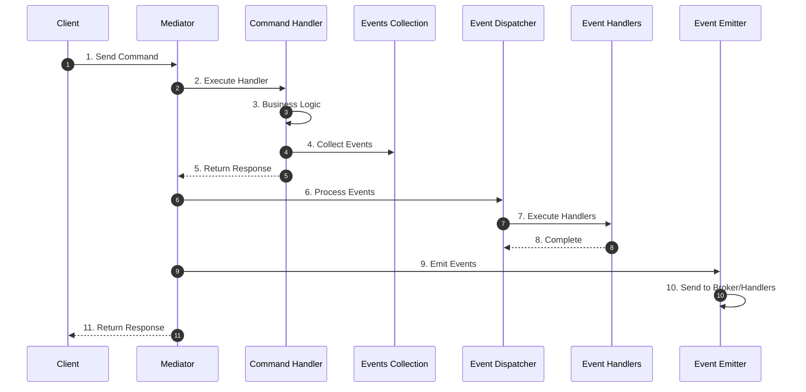
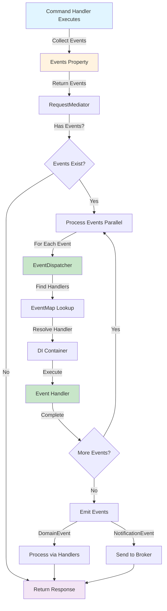
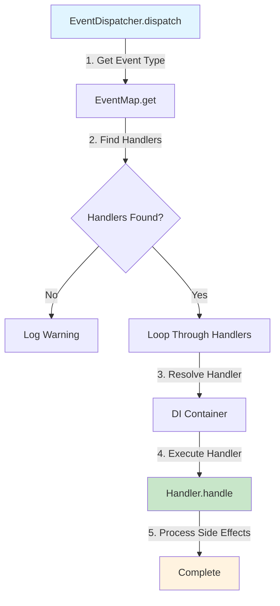
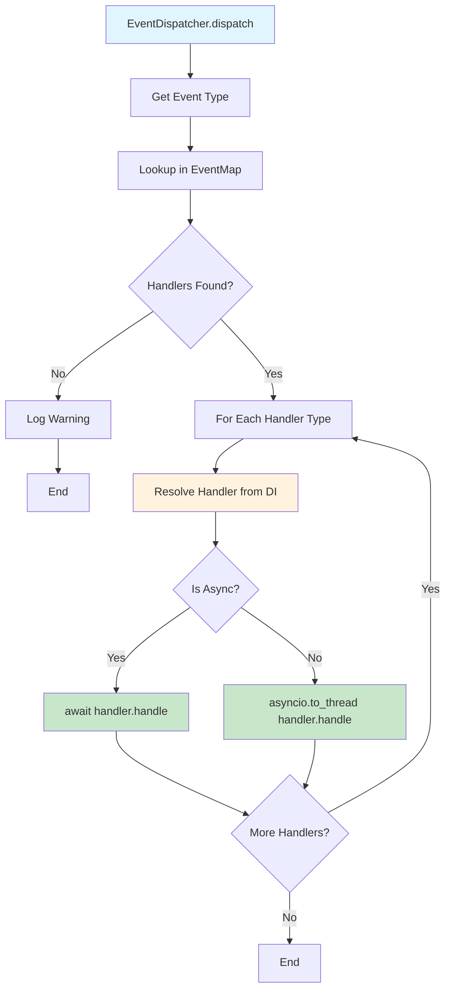
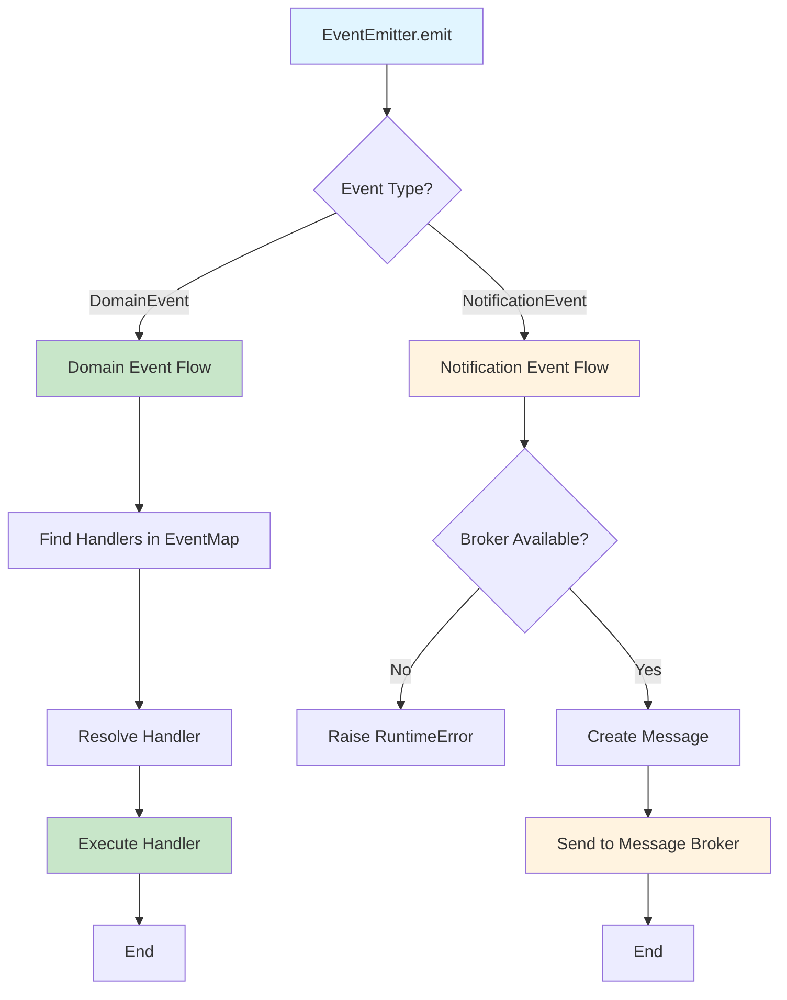
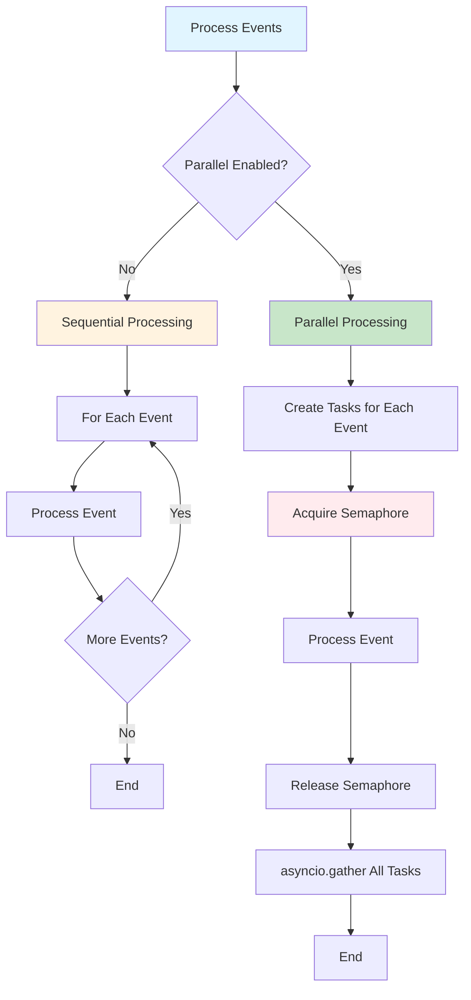

# Event Handling

## Table of Contents

- [Overview](#overview)
- [Event Flow](#event-flow)
- [How It Works](#how-it-works)
- [Runtime Processing](#runtime-processing)
- [Event Dispatcher Flow](#event-dispatcher-flow)
- [Event Emitter Flow](#event-emitter-flow)
- [Parallel Event Processing](#parallel-event-processing)
- [Complete Example](#complete-example)
- [Event Types](#event-types)
- [Best Practices](#best-practices)
- [Summary](#summary)

Event handlers process domain events that are emitted from command handlers. These events represent something that happened in the domain and trigger side effects like sending notifications, updating read models, or triggering other workflows.

## Overview

When a command handler processes a request, it can emit domain events through the `events` property. These events are automatically collected and processed by event handlers registered in the system.

**Key Points:**

- **Runtime Processing** — Events are processed synchronously in the same request context, not asynchronously
- **Automatic Dispatch** — Events are automatically dispatched to registered handlers after command execution
- **Parallel Support** — Multiple events can be processed in parallel with configurable concurrency limits
- **Side Effects** — Event handlers perform side effects without blocking the main command flow

## Event Flow

The event handling flow follows these steps:

### High-Level Flow



### Detailed Event Processing Flow



## How It Works

### 1. Event Collection

Command handlers collect events in the `events` property:

```python
class JoinMeetingCommandHandler(RequestHandler[JoinMeetingCommand, None]):
    def __init__(self):
        self._events: list[Event] = []

    @property
    def events(self) -> list[Event]:
        return self._events

    async def handle(self, request: JoinMeetingCommand) -> None:
        # Business logic
        STORAGE[request.meeting_id].append(request.user_id)
        
        # Collect domain event
        self._events.append(
            UserJoined(user_id=request.user_id, meeting_id=request.meeting_id)
        )
```

### 2. Event Dispatch

After the command handler completes, the mediator collects events and dispatches them:

```python
# In RequestMediator.send()
dispatch_result = await self._dispatcher.dispatch(request)

if dispatch_result.events:
    # Process events (parallel or sequential)
    await self._process_events_parallel(dispatch_result.events.copy())
    # Emit events to broker or handlers
    await self._send_events(dispatch_result.events.copy())
```

### 3. Event Processing

Events are processed through `EventDispatcher`, which finds registered handlers and executes them:



### 4. Event Emission

After processing, events are emitted through `EventEmitter`:

- **DomainEvent** — Processed by event handlers (in-process)
- **NotificationEvent** — Sent to message broker (Kafka, RabbitMQ, etc.)

## Runtime Processing

**Important:** Events are processed **synchronously** in the same request context, not asynchronously. This means:

- Events are processed **before** the command response is returned
- Event handlers execute **in the same request lifecycle**
- If an event handler fails, it can affect the command response
- Events are **not** queued or processed in background

### Why Runtime Processing?

Runtime processing ensures:

1. **Consistency** — Events are processed immediately, ensuring data consistency
2. **Error Handling** — Errors in event handlers can be caught and handled in the same request
3. **Transaction Safety** — Events can be part of the same transaction as business logic
4. **Predictability** — You know when events are processed (immediately after command)

### Example Flow

```python
# Command execution
await mediator.send(JoinMeetingCommand(user_id="123", meeting_id="456"))

# What happens:
# 1. Command handler executes (synchronously)
# 2. Events are collected from handler.events
# 3. Events are processed by handlers (synchronously, in parallel if enabled)
# 4. Events are emitted (synchronously)
# 5. Response is returned
```

## Event Dispatcher Flow

The `EventDispatcher` is responsible for routing events to their handlers:



### Dispatcher Implementation

```python
class EventDispatcher:
    async def dispatch(self, event: Event) -> None:
        # 1. Find handlers for event type
        handler_types = self._event_map.get(type(event), [])
        
        if not handler_types:
            logger.warning(f"Handlers for event {type(event).__name__} not found")
            return
        
        # 2. Process each handler
        for handler_type in handler_types:
            # 3. Resolve handler from DI container
            handler = await self._container.resolve(handler_type)
            
            # 4. Execute handler (async or sync)
            if asyncio.iscoroutinefunction(handler.handle):
                await handler.handle(event)
            else:
                await asyncio.to_thread(handler.handle, event)
```

## Event Emitter Flow

The `EventEmitter` is responsible for emitting events after processing:



### Emitter Implementation

```python
class EventEmitter:
    @emit.register
    async def _(self, event: DomainEvent) -> None:
        # Find handlers for domain event
        handlers_types = self._event_map.get(type(event), [])
        
        for handler_type in handlers_types:
            handler = await self._container.resolve(handler_type)
            
            # Execute handler
            if asyncio.iscoroutinefunction(handler.handle):
                await handler.handle(event)
            else:
                await asyncio.to_thread(handler.handle, event)
    
    @emit.register
    async def _(self, event: NotificationEvent) -> None:
        # Send to message broker
        await self._send_to_broker(event)
```

## Parallel Event Processing

Events can be processed in parallel to improve performance. This is controlled by two parameters:

- **`max_concurrent_event_handlers`** — Maximum number of event handlers running simultaneously
- **`concurrent_event_handle_enable`** — Enable/disable parallel processing

### How Parallel Processing Works



### Implementation

```python
class RequestMediator:
    def __init__(
        self,
        max_concurrent_event_handlers: int = 1,
        concurrent_event_handle_enable: bool = True,
    ):
        # Create semaphore to limit concurrency
        self._event_semaphore = asyncio.Semaphore(max_concurrent_event_handlers)
        self._concurrent_event_handle_enable = concurrent_event_handle_enable
    
    async def _process_event_with_semaphore(self, event: Event) -> None:
        """Process a single event with semaphore limit."""
        async with self._event_semaphore:
            await self._event_dispatcher.dispatch(event)
    
    async def _process_events_parallel(
        self,
        events: List[Event],
    ) -> None:
        """Process events in parallel with semaphore limit or sequentially."""
        if not events:
            return
        
        if not self._concurrent_event_handle_enable:
            # Sequential processing
            for event in events:
                await self._event_dispatcher.dispatch(event)
        else:
            # Parallel processing with semaphore limit
            tasks = [
                self._process_event_with_semaphore(event) 
                for event in events
            ]
            await asyncio.gather(*tasks)
```

### Configuration

```python
from cqrs.requests import bootstrap

# Enable parallel processing with max 3 concurrent handlers
mediator = bootstrap.bootstrap(
    di_container=container,
    commands_mapper=commands_mapper,
    domain_events_mapper=domain_events_mapper,
    max_concurrent_event_handlers=3,  # Max 3 handlers at once
    concurrent_event_handle_enable=True,  # Enable parallel processing
)
```

### Default Values

- **`RequestMediator`** — `max_concurrent_event_handlers=1`, `concurrent_event_handle_enable=True`
- **`StreamingRequestMediator`** — `max_concurrent_event_handlers=10`, `concurrent_event_handle_enable=True`

### Example: Parallel Processing

```python
# Command handler emits multiple events
class ProcessOrderCommandHandler(RequestHandler[ProcessOrderCommand, None]):
    def __init__(self):
        self._events: list[Event] = []

    @property
    def events(self) -> list[Event]:
        return self._events

    async def handle(self, request: ProcessOrderCommand) -> None:
        # Business logic
        ...
        
        # Emit multiple events
        self._events.append(OrderProcessedEvent(...))
        self._events.append(InventoryUpdateEvent(...))
        self._events.append(AuditLogEvent(...))
        self._events.append(EmailNotificationEvent(...))

# With max_concurrent_event_handlers=3:
# - Events 1-3 process in parallel
# - Event 4 waits for a slot
# - All events complete before response is returned
```

## Complete Example

Here's a complete example demonstrating event handling:

```python
import asyncio
import di
import cqrs
from cqrs.requests import bootstrap

# Domain event
class UserJoined(cqrs.DomainEvent, frozen=True):
    user_id: str
    meeting_id: str

# Command handler
class JoinMeetingCommand(cqrs.Request):
    user_id: str
    meeting_id: str

class JoinMeetingCommandHandler(cqrs.RequestHandler[JoinMeetingCommand, None]):
    def __init__(self):
        self._events: list[cqrs.Event] = []

    @property
    def events(self) -> list[cqrs.Event]:
        return self._events

    async def handle(self, request: JoinMeetingCommand) -> None:
        # Business logic
        print(f"User {request.user_id} joined meeting {request.meeting_id}")
        
        # Emit domain event
        self._events.append(
            UserJoined(user_id=request.user_id, meeting_id=request.meeting_id)
        )

# Event handler
class UserJoinedEventHandler(cqrs.EventHandler[UserJoined]):
    async def handle(self, event: UserJoined) -> None:
        print(f"Processing event: User {event.user_id} joined meeting {event.meeting_id}")
        # Side effects: send notification, update read model, etc.

# Mappers
def commands_mapper(mapper: cqrs.RequestMap) -> None:
    mapper.bind(JoinMeetingCommand, JoinMeetingCommandHandler)

def domain_events_mapper(mapper: cqrs.EventMap) -> None:
    mapper.bind(UserJoined, UserJoinedEventHandler)

# Bootstrap with parallel processing
mediator = bootstrap.bootstrap(
    di_container=di.Container(),
    commands_mapper=commands_mapper,
    domain_events_mapper=domain_events_mapper,
    max_concurrent_event_handlers=3,
    concurrent_event_handle_enable=True,
)

# Execute command
await mediator.send(JoinMeetingCommand(user_id="123", meeting_id="456"))

# Flow:
# 1. Command handler executes
# 2. UserJoined event is collected
# 3. EventDispatcher processes event (finds UserJoinedEventHandler)
# 4. UserJoinedEventHandler.handle() executes
# 5. Response is returned
```

## Event Types

### DomainEvent

Domain events represent something that happened in the domain. They are processed by event handlers:

```python
class UserJoined(cqrs.DomainEvent, frozen=True):
    user_id: str
    meeting_id: str

class UserJoinedEventHandler(cqrs.EventHandler[UserJoined]):
    async def handle(self, event: UserJoined) -> None:
        # Process domain event
        ...
```

### NotificationEvent

Notification events are sent to message brokers:

```python
class UserJoinedNotification(cqrs.NotificationEvent[UserJoinedPayload]):
    event_name: str = "user_joined"
    topic: str = "user_events"
    payload: UserJoinedPayload

# Automatically sent to message broker via EventEmitter
```

## Best Practices

1. **Keep handlers fast** — Event handlers execute synchronously, so keep them fast
2. **Handle errors** — Implement error handling in event handlers
3. **Use parallel processing** — Enable parallel processing for independent events
4. **Limit concurrency** — Set appropriate `max_concurrent_event_handlers` based on resources
5. **Idempotency** — Make event handlers idempotent when possible
6. **Logging** — Log important events for debugging and monitoring

## Summary

Event handling in `python-cqrs`:

- **Runtime Processing** — Events are processed synchronously in the same request context
- **Automatic Dispatch** — Events are automatically dispatched to registered handlers
- **Parallel Support** — Multiple events can be processed in parallel with configurable limits
- **Two Types** — DomainEvent (in-process) and NotificationEvent (message broker)
- **Side Effects** — Event handlers perform side effects without blocking command execution

Use event handlers to implement side effects like notifications, read model updates, and workflow triggers while keeping your command handlers focused on business logic.
