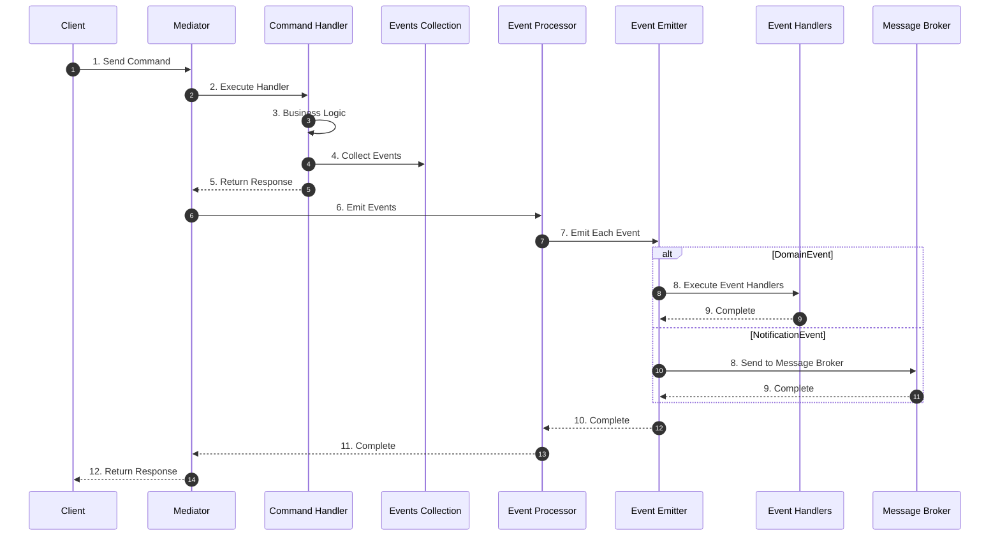
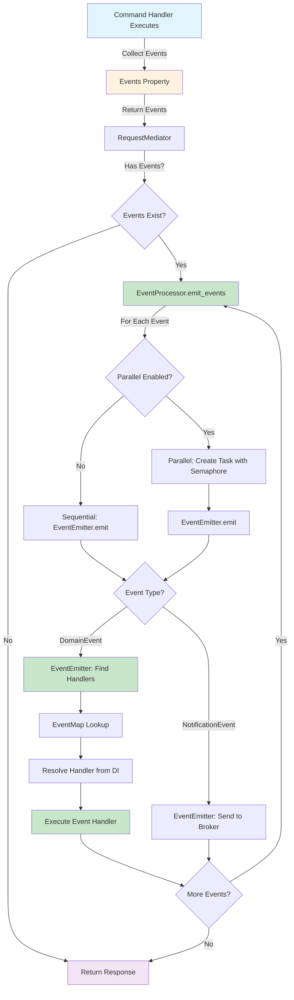
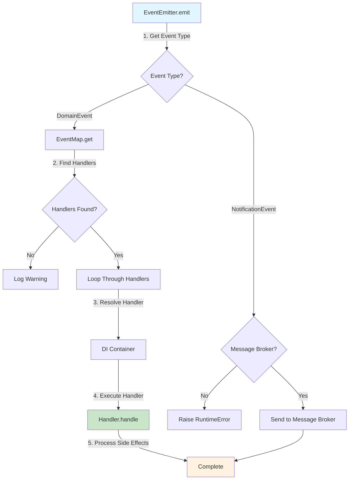

# Event Flow

<div class="grid cards" markdown>

-   :material-home: **Back to Event Handling Overview**

    Return to the Event Handling overview page with all topics.

    [:octicons-arrow-left-24: Back to Overview](index.md)

</div>

---

## Overview

The event handling flow follows these steps:

### High-Level Flow



### Detailed Event Processing Flow




### 1. Event Collection

Command handlers collect events in the `events` property:

```python
class JoinMeetingCommandHandler(RequestHandler[JoinMeetingCommand, None]):
    def __init__(self):
        self._events: list[Event] = []

    @property
    def events(self) -> list[Event]:
        return self._events

    async def handle(self, request: JoinMeetingCommand) -> None:
        # Business logic
        STORAGE[request.meeting_id].append(request.user_id)
        
        # Collect domain event
        self._events.append(
            UserJoined(user_id=request.user_id, meeting_id=request.meeting_id)
        )
```

### 2. Event Emission

After the command handler completes, the mediator collects events and emits them through EventProcessor:

```python
dispatch_result = await self._dispatcher.dispatch(request)

# Events are emitted through EventProcessor
# EventProcessor uses EventEmitter which handles:
# - DomainEvent: processes via event handlers (in-process)
# - NotificationEvent: sends to message broker
await self._event_processor.emit_events(dispatch_result.events)
```

The `EventProcessor` handles parallel or sequential processing based on configuration, and `EventEmitter` routes events to appropriate handlers or message brokers.

### 3. Event Processing via EventEmitter

Events are processed through `EventEmitter`, which routes them based on event type:



### 4. Event Routing

`EventEmitter` automatically routes events based on their type:

- **DomainEvent** — Processed by event handlers registered in EventMap (in-process, synchronous)
- **NotificationEvent** — Sent to message broker (Kafka, RabbitMQ, etc.) for asynchronous processing

!!! important "Single Processing"
    Events are processed **only once** through EventEmitter. There is no duplicate processing - DomainEvents are handled by event handlers, and NotificationEvents are sent to message brokers.
