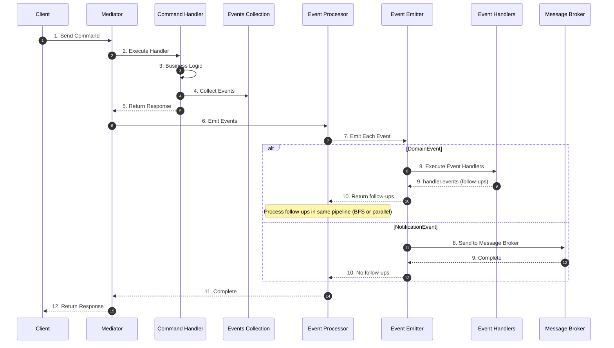
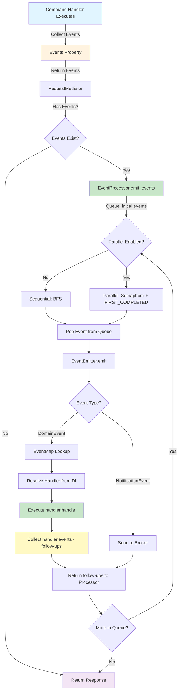
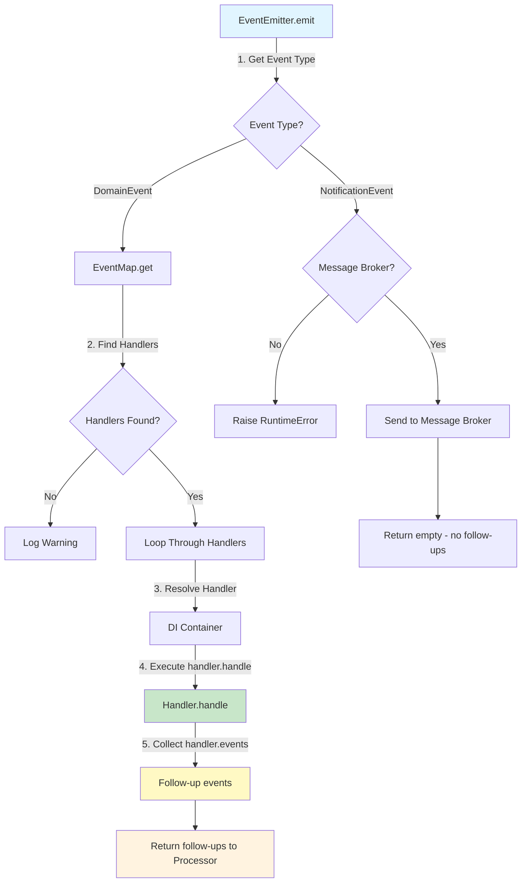

# Event Flow

<div class="grid cards" markdown>

-   :material-home: **Back to Event Handling Overview**

    Return to the Event Handling overview page with all topics.

    [:octicons-arrow-left-24: Back to Overview](index.md)

</div>

---

## Overview

The event handling flow follows these steps:

### High-Level Flow



!!! note "Follow-up events"
    For domain events, handlers can return follow-up events via the `events` property. The processor continues emitting these in the same pipeline (sequential BFS or parallel with semaphore) until the queue is empty.

### Detailed Event Processing Flow




### 1. Event Collection

Command handlers collect events in the `events` property:

```python
class JoinMeetingCommandHandler(RequestHandler[JoinMeetingCommand, None]):
    def __init__(self):
        self._events: list[Event] = []

    @property
    def events(self) -> list[Event]:
        return self._events

    async def handle(self, request: JoinMeetingCommand) -> None:
        # Business logic
        STORAGE[request.meeting_id].append(request.user_id)
        
        # Collect domain event
        self._events.append(
            UserJoined(user_id=request.user_id, meeting_id=request.meeting_id)
        )
```

### 2. Event Emission

After the command handler completes, the mediator collects events and emits them through EventProcessor:

```python
dispatch_result = await self._dispatcher.dispatch(request)

# Events are emitted through EventProcessor
# EventProcessor uses EventEmitter which handles:
# - DomainEvent: processes via event handlers (in-process)
# - NotificationEvent: sends to message broker
await self._event_processor.emit_events(dispatch_result.events)
```

The `EventProcessor` handles parallel or sequential processing based on configuration, and `EventEmitter` routes events to appropriate handlers or message brokers.

### 3. Event Processing via EventEmitter

Events are processed through `EventEmitter`, which routes them based on event type. For domain events, after each handler runs, follow-up events from `handler.events` are collected and returned; the processor then continues with these in the same pipeline (BFS in sequential mode, or under the same semaphore in parallel mode).



### 3.1. Follow-up events from event handlers (event propagation)

Event handlers can produce **follow-up events** by implementing the `events` property. After `handle()` is called, the emitter reads `handler.events` and returns them to the processor. These follow-ups are processed in the **same pipeline**:

| Mode | Behavior |
|------|----------|
| **Sequential** (`concurrent_event_handle_enable=False`) | Events and follow-ups are processed in **BFS order**: one event at a time, then its follow-ups are appended to the queue. |
| **Parallel** (`concurrent_event_handle_enable=True`) | Events are processed under a semaphore; as soon as any task completes, its follow-ups are queued and started (FIRST_COMPLETED), without waiting for sibling events. |

This allows **multi-level event chains**: e.g. `OrderCreated` → handler emits `InventoryReserved` → handler emits `NotificationScheduled`, all in one run.

Example: handler that produces a follow-up event:

```python
class OrderCreatedEventHandler(cqrs.EventHandler[OrderCreatedEvent]):
    def __init__(self) -> None:
        self._follow_ups: list[cqrs.IEvent] = []

    @property
    def events(self) -> typing.Sequence[cqrs.IEvent]:
        return tuple(self._follow_ups)

    async def handle(self, event: OrderCreatedEvent) -> None:
        # Side effects...
        self._follow_ups.append(InventoryReservedEvent(order_id=event.order_id))
```

### 4. Event Routing

`EventEmitter` automatically routes events based on their type:

- **DomainEvent** — Processed by event handlers registered in EventMap (in-process). Handlers may return follow-up events via the `events` property; these are processed in the same pipeline (BFS or parallel with semaphore).
- **NotificationEvent** — Sent to message broker (Kafka, RabbitMQ, etc.) for asynchronous processing; no follow-ups.

!!! important "Single Processing"
    Each event instance is processed **only once** through EventEmitter. Follow-up events returned by handlers are **new** events that are then processed in the same run (same pipeline) until the queue is empty.
