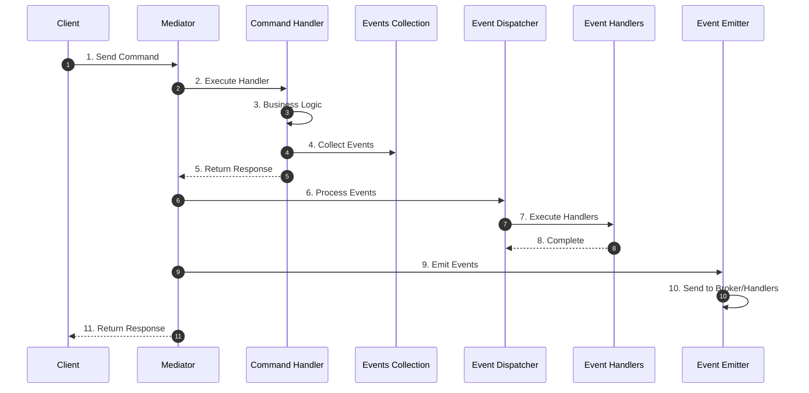
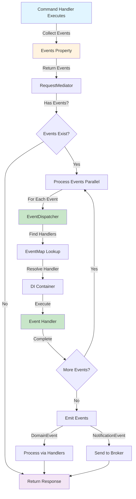
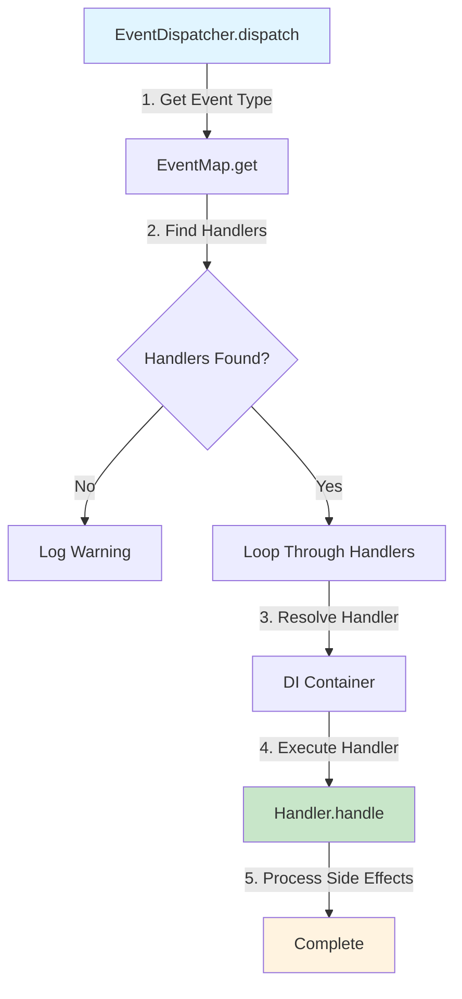

# Event Flow

See [Event Handling Overview](index.md) for general information.

---

## Overview

The event handling flow follows these steps:

### High-Level Flow



### Detailed Event Processing Flow




### 1. Event Collection

Command handlers collect events in the `events` property:

```python
class JoinMeetingCommandHandler(RequestHandler[JoinMeetingCommand, None]):
    def __init__(self):
        self._events: list[Event] = []

    @property
    def events(self) -> list[Event]:
        return self._events

    async def handle(self, request: JoinMeetingCommand) -> None:
        # Business logic
        STORAGE[request.meeting_id].append(request.user_id)
        
        # Collect domain event
        self._events.append(
            UserJoined(user_id=request.user_id, meeting_id=request.meeting_id)
        )
```

### 2. Event Dispatch

After the command handler completes, the mediator collects events and dispatches them:

```python
dispatch_result = await self._dispatcher.dispatch(request)

if dispatch_result.events:
    # Process events (parallel or sequential)
    await self._process_events_parallel(dispatch_result.events.copy())
    # Emit events to broker or handlers
    await self._send_events(dispatch_result.events.copy())
```

### 3. Event Processing

Events are processed through `EventDispatcher`, which finds registered handlers and executes them:



### 4. Event Emission

After processing, events are emitted through `EventEmitter`:

- **DomainEvent** — Processed by event handlers (in-process)
- **NotificationEvent** — Sent to message broker (Kafka, RabbitMQ, etc.)
