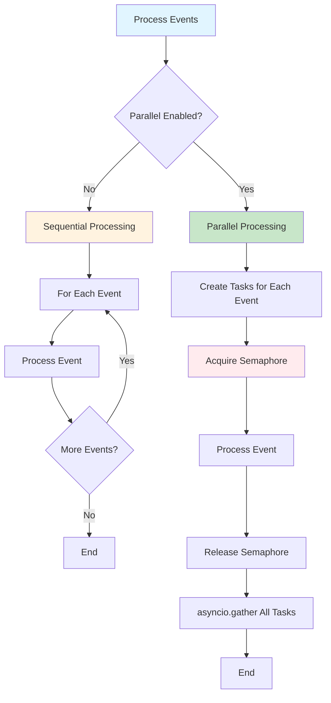

# Parallel Event Processing

<div class="grid cards" markdown>

-   :material-home: **Back to Event Handling Overview**

    Return to the Event Handling overview page with all topics.

    [:octicons-arrow-left-24: Back to Overview](index.md)

</div>

---

## Overview


Events can be processed in parallel to improve performance. This is controlled by two parameters:

- **`max_concurrent_event_handlers`** — Maximum number of event handlers running simultaneously
- **`concurrent_event_handle_enable`** — Enable/disable parallel processing

### How Parallel Processing Works



### Implementation

```python
class RequestMediator:
    def __init__(
        self,
        max_concurrent_event_handlers: int = 1,
        concurrent_event_handle_enable: bool = True,
    ):
        # Create semaphore to limit concurrency
        self._event_semaphore = asyncio.Semaphore(max_concurrent_event_handlers)
        self._concurrent_event_handle_enable = concurrent_event_handle_enable
    
    async def _process_event_with_semaphore(self, event: Event) -> None:
        """Process a single event with semaphore limit."""
        async with self._event_semaphore:
            await self._event_dispatcher.dispatch(event)
    
    async def _process_events_parallel(
        self,
        events: List[Event],
    ) -> None:
        """Process events in parallel with semaphore limit or sequentially."""
        if not events:
            return
        
        if not self._concurrent_event_handle_enable:
            # Sequential processing
            for event in events:
                await self._event_dispatcher.dispatch(event)
        else:
            # Parallel processing with semaphore limit
            tasks = [
                self._process_event_with_semaphore(event) 
                for event in events
            ]
            await asyncio.gather(*tasks)
```

### Configuration

```python
from cqrs.requests import bootstrap

# Enable parallel processing with max 3 concurrent handlers
mediator = bootstrap.bootstrap(
    di_container=container,
    commands_mapper=commands_mapper,
    domain_events_mapper=domain_events_mapper,
    max_concurrent_event_handlers=3,  # Max 3 handlers at once
    concurrent_event_handle_enable=True,  # Enable parallel processing
)
```

### Default Values

- **`RequestMediator`** — `max_concurrent_event_handlers=1`, `concurrent_event_handle_enable=True`
- **`StreamingRequestMediator`** — `max_concurrent_event_handlers=10`, `concurrent_event_handle_enable=True`

### Example: Parallel Processing

```python
# Command handler emits multiple events
class ProcessOrderCommandHandler(RequestHandler[ProcessOrderCommand, None]):
    def __init__(self):
        self._events: list[Event] = []

    @property
    def events(self) -> list[Event]:
        return self._events

    async def handle(self, request: ProcessOrderCommand) -> None:
        # Business logic
        ...
        
        # Emit multiple events
        self._events.append(OrderProcessedEvent(...))
        self._events.append(InventoryUpdateEvent(...))
        self._events.append(AuditLogEvent(...))
        self._events.append(EmailNotificationEvent(...))

# With max_concurrent_event_handlers=3:
# - Events 1-3 process in parallel
# - Event 4 waits for a slot
# - All events complete before response is returned
```
