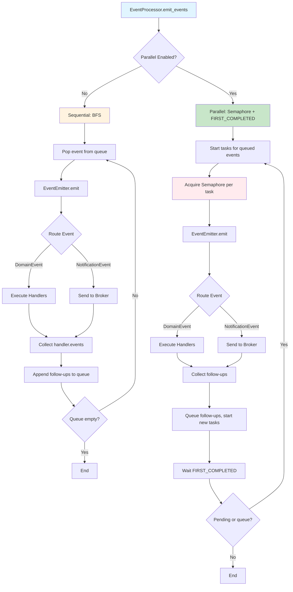

# Parallel Event Processing

<div class="grid cards" markdown>

-   :material-home: **Back to Event Handling Overview**

    Return to the Event Handling overview page with all topics.

    [:octicons-arrow-left-24: Back to Overview](index.md)

</div>

---

## Overview


Events can be processed in parallel to improve performance. This is controlled by two parameters:

- **`max_concurrent_event_handlers`** — Maximum number of event handlers running simultaneously
- **`concurrent_event_handle_enable`** — Enable/disable parallel processing

### How Parallel Processing Works

In **sequential** mode, events and follow-ups (from `handler.events`) are processed in **BFS order**: one event at a time, then its follow-ups are appended to the queue. In **parallel** mode, events are processed under a semaphore; as soon as any task completes (FIRST_COMPLETED), its follow-up events are queued and started without waiting for sibling events. `emit_events` returns only when all events and follow-ups are done.



### Implementation

The `EventProcessor` handles parallel or sequential event emission. Follow-up events returned by handlers (via `handler.events`) are processed in the **same pipeline**: BFS in sequential mode, or under the same semaphore with FIRST_COMPLETED in parallel mode. The method returns when all events and follow-ups are done.

```python
class EventProcessor:
    def __init__(
        self,
        event_map: EventMap,
        event_emitter: EventEmitter | None = None,
        max_concurrent_event_handlers: int = 1,
        concurrent_event_handle_enable: bool = True,
    ):
        self._event_emitter = event_emitter
        self._max_concurrent_event_handlers = max_concurrent_event_handlers
        self._concurrent_event_handle_enable = concurrent_event_handle_enable
        self._event_semaphore = asyncio.Semaphore(max_concurrent_event_handlers)
    
    async def emit_events(self, events: Sequence[IEvent]) -> None:
        """Emit events and process follow-ups in the same pipeline."""
        if not events or not self._event_emitter:
            return
        
        if not self._concurrent_event_handle_enable:
            # Sequential: BFS over events and follow-ups
            to_process = deque(events)
            while to_process:
                event = to_process.popleft()
                follow_ups = await self._event_emitter.emit(event)
                to_process.extend(follow_ups)
        else:
            # Parallel: tasks under semaphore; follow-ups queued on FIRST_COMPLETED
            await self._emit_events_parallel_first_completed(deque(events))
    
    async def _emit_one_event(self, event: IEvent) -> Sequence[IEvent]:
        """Emit one event under semaphore; returns follow-ups from handler.events."""
        async with self._event_semaphore:
            return await self._event_emitter.emit(event)
```

The `EventEmitter.emit()` returns follow-up events from domain event handlers; the processor continues with these until the queue is empty.

### Configuration

```python
from cqrs.requests import bootstrap

# Enable parallel processing with max 3 concurrent handlers
mediator = bootstrap.bootstrap(
    di_container=container,
    commands_mapper=commands_mapper,
    domain_events_mapper=domain_events_mapper,
    max_concurrent_event_handlers=3,  # Max 3 handlers at once
    concurrent_event_handle_enable=True,  # Enable parallel processing
)
```

### Default Values

- **`RequestMediator`** — `max_concurrent_event_handlers=1`, `concurrent_event_handle_enable=True`
- **`StreamingRequestMediator`** — `max_concurrent_event_handlers=10`, `concurrent_event_handle_enable=True`

### Example: Parallel Processing

```python
# Command handler emits multiple events
class ProcessOrderCommandHandler(RequestHandler[ProcessOrderCommand, None]):
    def __init__(self):
        self._events: list[Event] = []

    @property
    def events(self) -> list[Event]:
        return self._events

    async def handle(self, request: ProcessOrderCommand) -> None:
        # Business logic
        ...
        
        # Emit multiple events
        self._events.append(OrderProcessedEvent(...))
        self._events.append(InventoryUpdateEvent(...))
        self._events.append(AuditLogEvent(...))
        self._events.append(EmailNotificationEvent(...))

# With max_concurrent_event_handlers=3:
# - Up to 3 events (or follow-ups) run at once under the semaphore
# - When any task completes, its follow-ups (from handler.events) are queued and started (FIRST_COMPLETED)
# - emit_events() returns only when all events and follow-ups are done
# - Each event is routed by EventEmitter:
#   - DomainEvents → processed by handlers (follow-ups collected and processed in same pipeline)
#   - NotificationEvents → sent to message broker (no follow-ups)
```
