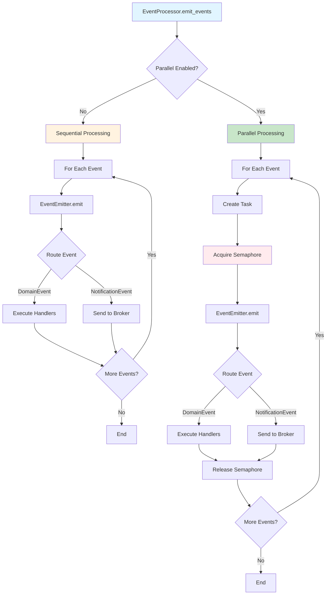

# Parallel Event Processing

<div class="grid cards" markdown>

-   :material-home: **Back to Event Handling Overview**

    Return to the Event Handling overview page with all topics.

    [:octicons-arrow-left-24: Back to Overview](index.md)

</div>

---

## Overview


Events can be processed in parallel to improve performance. This is controlled by two parameters:

- **`max_concurrent_event_handlers`** — Maximum number of event handlers running simultaneously
- **`concurrent_event_handle_enable`** — Enable/disable parallel processing

### How Parallel Processing Works



### Implementation

The `EventProcessor` handles parallel or sequential event emission:

```python
class EventProcessor:
    def __init__(
        self,
        event_map: EventMap,
        event_emitter: EventEmitter | None = None,
        max_concurrent_event_handlers: int = 1,
        concurrent_event_handle_enable: bool = True,
    ):
        self._event_emitter = event_emitter
        self._max_concurrent_event_handlers = max_concurrent_event_handlers
        self._concurrent_event_handle_enable = concurrent_event_handle_enable
        self._event_semaphore = asyncio.Semaphore(max_concurrent_event_handlers)
    
    async def emit_events(self, events: List[Event]) -> None:
        """Emit events via event emitter (parallel or sequential)."""
        if not events or not self._event_emitter:
            return
        
        if not self._concurrent_event_handle_enable:
            # Sequential processing
            for event in events:
                await self._event_emitter.emit(event)
        else:
            # Parallel processing with semaphore limit (fire-and-forget)
            for event in events:
                asyncio.create_task(self._emit_event_with_semaphore(event))
    
    async def _emit_event_with_semaphore(self, event: Event) -> None:
        """Emit a single event with semaphore limit."""
        async with self._event_semaphore:
            await self._event_emitter.emit(event)
```

The `EventEmitter` then routes events to handlers or message brokers based on event type.

### Configuration

```python
from cqrs.requests import bootstrap

# Enable parallel processing with max 3 concurrent handlers
mediator = bootstrap.bootstrap(
    di_container=container,
    commands_mapper=commands_mapper,
    domain_events_mapper=domain_events_mapper,
    max_concurrent_event_handlers=3,  # Max 3 handlers at once
    concurrent_event_handle_enable=True,  # Enable parallel processing
)
```

### Default Values

- **`RequestMediator`** — `max_concurrent_event_handlers=1`, `concurrent_event_handle_enable=True`
- **`StreamingRequestMediator`** — `max_concurrent_event_handlers=10`, `concurrent_event_handle_enable=True`

### Example: Parallel Processing

```python
# Command handler emits multiple events
class ProcessOrderCommandHandler(RequestHandler[ProcessOrderCommand, None]):
    def __init__(self):
        self._events: list[Event] = []

    @property
    def events(self) -> list[Event]:
        return self._events

    async def handle(self, request: ProcessOrderCommand) -> None:
        # Business logic
        ...
        
        # Emit multiple events
        self._events.append(OrderProcessedEvent(...))
        self._events.append(InventoryUpdateEvent(...))
        self._events.append(AuditLogEvent(...))
        self._events.append(EmailNotificationEvent(...))

# With max_concurrent_event_handlers=3:
# - Events 1-3 emit in parallel (fire-and-forget tasks)
# - Event 4 waits for a semaphore slot
# - Each event is routed by EventEmitter:
#   - DomainEvents → processed by handlers
#   - NotificationEvents → sent to message broker
```
