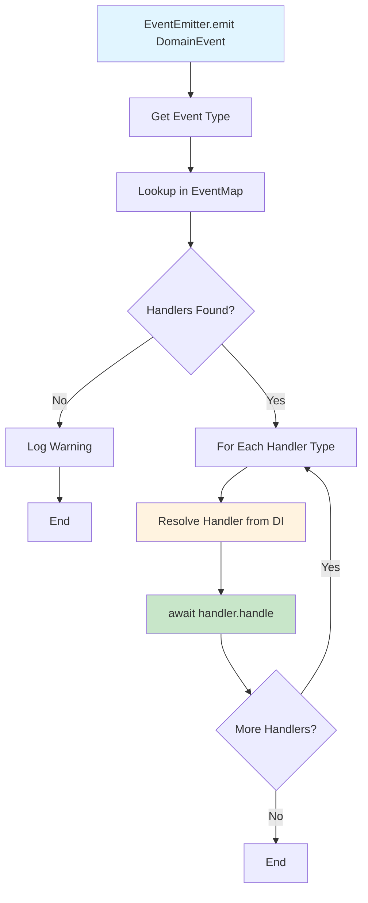
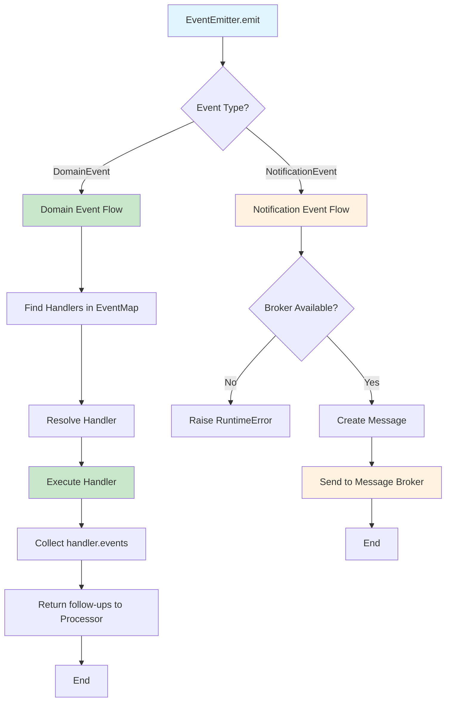

# Runtime Processing

<div class="grid cards" markdown>

-   :material-home: **Back to Event Handling Overview**

    Return to the Event Handling overview page with all topics.

    [:octicons-arrow-left-24: Back to Overview](index.md)

</div>

---

## Overview


**Important:** Events are processed **synchronously** in the same request context, not asynchronously. This means:

- Events are processed **before** the command response is returned
- Event handlers execute **in the same request lifecycle**
- If an event handler fails, it can affect the command response
- Events are **not** queued or processed in background

### Why Runtime Processing?

Runtime processing ensures:

1. **Consistency** — Events are processed immediately, ensuring data consistency
2. **Error Handling** — Errors in event handlers can be caught and handled in the same request
3. **Transaction Safety** — Events can be part of the same transaction as business logic
4. **Predictability** — You know when events are processed (immediately after command)

### Example Flow

```python
# Command execution
await mediator.send(JoinMeetingCommand(user_id="123", meeting_id="456"))

# What happens:
# 1. Command handler executes (synchronously)
# 2. Events are collected from handler.events
# 3. Events are emitted through EventProcessor (synchronously, in parallel if enabled)
#    - EventProcessor uses EventEmitter which routes events:
#      - DomainEvent → processed by event handlers (in-process)
#      - NotificationEvent → sent to message broker
# 4. Response is returned
```


The `EventEmitter` routes events to their handlers or message brokers. For DomainEvents, it uses EventDispatcher logic internally:



### EventEmitter Implementation for DomainEvents

`EventEmitter.emit()` returns a **sequence of follow-up events** from handlers. The processor uses these to continue the pipeline (BFS in sequential mode, or under the same semaphore in parallel mode).

```python
class EventEmitter:
    @emit.register
    async def _(self, event: DomainEvent) -> Sequence[IEvent]:
        # 1. Find handlers for event type
        handlers_types = self._event_map.get(type(event), [])
        
        if not handlers_types:
            logger.warning(f"Handlers for event {type(event).__name__} not found")
            return ()
        
        follow_ups: list[IEvent] = []
        # 2. Process each handler
        for handler_type in handlers_types:
            # 3. Resolve handler from DI container
            handler = await self._container.resolve(handler_type)
            
            # 4. Execute handler
            await handler.handle(event)
            # 5. Collect follow-up events from handler.events
            follow_ups.extend(list(handler.events))
        
        return follow_ups
```

The `EventEmitter` is responsible for emitting events and routing them based on type:



### Emitter Implementation

```python
class EventEmitter:
    @emit.register
    async def _(self, event: DomainEvent) -> Sequence[IEvent]:
        # Find handlers for domain event
        handlers_types = self._event_map.get(type(event), [])
        follow_ups: list[IEvent] = []
        for handler_type in handlers_types:
            handler = await self._container.resolve(handler_type)
            await handler.handle(event)
            follow_ups.extend(list(handler.events))  # Follow-ups processed in same pipeline
        return follow_ups
    
    @emit.register
    async def _(self, event: NotificationEvent) -> Sequence[IEvent]:
        await self._send_to_broker(event)
        return ()  # No follow-ups for notification events
```
