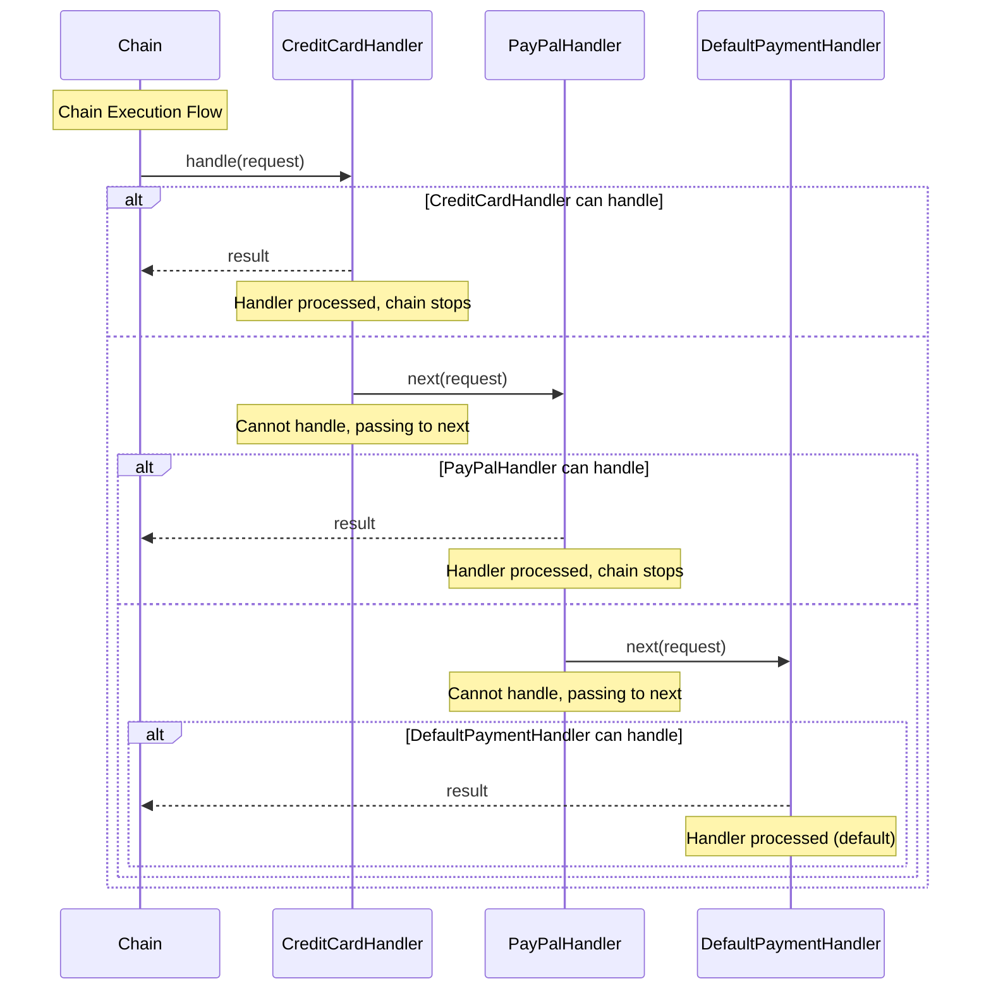
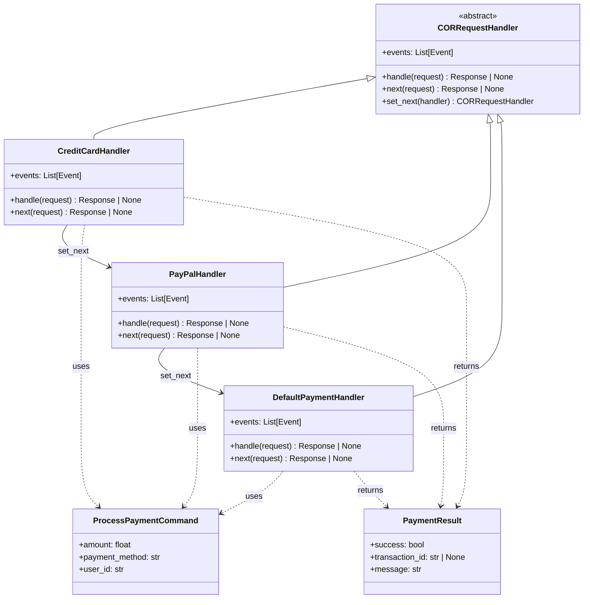

# Mermaid Diagram Generation for Chain of Responsibility

The package includes built-in support for generating Mermaid diagrams from Chain of Responsibility handler chains. This feature is perfect for documentation, visualization, and understanding handler chain structure and execution flow.

## Overview

The `CoRMermaid` class can generate two types of diagrams:

1. **Sequence Diagram** - Shows the execution flow through the chain, successful handling, and pass-through scenarios
2. **Class Diagram** - Shows the type structure, relationships between handlers, request types, response types, and chain links

## Example

You can find a complete working example in the repository:

[**View Example: `cor_mermaid.py`**](https://github.com/vadikko2/python-cqrs/blob/master/examples/cor_mermaid.py)

### Basic Usage

```python
from cqrs.requests.mermaid import CoRMermaid
from cqrs.requests.cor_request_handler import CORRequestHandler

# Create your handler chain (see Chain of Responsibility documentation for details)
handlers = [
    CreditCardHandler,
    PayPalHandler,
    BankTransferHandler,
    DefaultPaymentHandler,
]

# Create Mermaid generator
generator = CoRMermaid(handlers)

# Generate Sequence diagram showing execution flow
sequence_diagram = generator.sequence()
print(sequence_diagram)

# Generate Class diagram showing type structure
class_diagram = generator.class_diagram()
print(class_diagram)
```

## Sequence Diagram

The Sequence diagram visualizes the complete execution flow of a handler chain using nested `alt/else` blocks:

- Each handler can either **process the request** (return result and stop the chain) or **pass to the next handler**
- The diagram shows all possible paths through the chain using nested conditional blocks
- **Any handler can process the request and stop the chain**, not just the last one
- Handler names (not aliases) are used in `alt` conditions for better readability

### Example Handler Chain Code

```python
from cqrs.requests.cor_request_handler import CORRequestHandler
from cqrs.response import Response

class ProcessPaymentCommand(cqrs.Request):
    amount: float
    payment_method: str
    user_id: str

class PaymentResult(Response):
    success: bool
    transaction_id: str | None = None
    message: str = ""

class CreditCardHandler(CORRequestHandler[ProcessPaymentCommand, PaymentResult]):
    async def handle(self, request: ProcessPaymentCommand) -> PaymentResult | None:
        if request.payment_method == "credit_card":
            return PaymentResult(success=True, transaction_id="cc_123")
        return await self.next(request)
    
class PayPalHandler(CORRequestHandler[ProcessPaymentCommand, PaymentResult]):
    async def handle(self, request: ProcessPaymentCommand) -> PaymentResult | None:
        if request.payment_method == "paypal":
            return PaymentResult(success=True, transaction_id="pp_123")
        return await self.next(request)
    
class DefaultPaymentHandler(CORRequestHandler[ProcessPaymentCommand, PaymentResult]):
    async def handle(self, request: ProcessPaymentCommand) -> PaymentResult | None:
        return PaymentResult(success=False, message="Unsupported method")

handlers = [CreditCardHandler, PayPalHandler, DefaultPaymentHandler]
```

### Generated Sequence Diagram

#### Text Format

```text
sequenceDiagram
    participant C as Chain
    participant H1 as CreditCardHandler
    participant H2 as PayPalHandler
    participant H3 as DefaultPaymentHandler

    Note over C: Chain Execution Flow
    C->>H1: handle(request)

    alt CreditCardHandler can handle
        H1-->>C: result
        Note over H1: Handler processed, chain stops
    else
        H1->>H2: next(request)
        Note over H1: Cannot handle, passing to next
        alt PayPalHandler can handle
            H2-->>C: result
            Note over H2: Handler processed, chain stops
        else
            H2->>H3: next(request)
            Note over H2: Cannot handle, passing to next
            alt DefaultPaymentHandler can handle
                H3-->>C: result
                Note over H3: Handler processed (default)
            end
        end
    end
```

#### Rendered Diagram



## Class Diagram

The Class diagram shows the complete type structure and relationships:

- CORRequestHandler base class with its methods
- Handler classes with their methods (`handle`, `next`, `events`)
- Request classes with their fields
- Response classes with their fields
- Relationships between classes (inheritance, chain links, usage, return types)

### Generated Class Diagram

#### Text Format

```text
classDiagram
    class CORRequestHandler {
        <<abstract>>
        +handle(request) Response | None
        +next(request) Response | None
        +set_next(handler) CORRequestHandler
        +events: List[Event]
    }

    class CreditCardHandler {
        +handle(request) Response | None
        +next(request) Response | None
        +events: List[Event]
    }

    class PayPalHandler {
        +handle(request) Response | None
        +next(request) Response | None
        +events: List[Event]
    }

    class DefaultPaymentHandler {
        +handle(request) Response | None
        +next(request) Response | None
        +events: List[Event]
    }

    class ProcessPaymentCommand {
        +amount: float
        +payment_method: str
        +user_id: str
    }

    class PaymentResult {
        +success: bool
        +transaction_id: str | None
        +message: str
    }

    %% Inheritance relationships
    CORRequestHandler <|-- CreditCardHandler
    CORRequestHandler <|-- PayPalHandler
    CORRequestHandler <|-- DefaultPaymentHandler

    %% Chain relationships (set_next)
    CreditCardHandler --> PayPalHandler : set_next
    PayPalHandler --> DefaultPaymentHandler : set_next

    %% Handler to Request relationships
    CreditCardHandler ..> ProcessPaymentCommand : uses
    PayPalHandler ..> ProcessPaymentCommand : uses
    DefaultPaymentHandler ..> ProcessPaymentCommand : uses

    %% Handler to Response relationships
    CreditCardHandler ..> PaymentResult : returns
    PayPalHandler ..> PaymentResult : returns
    DefaultPaymentHandler ..> PaymentResult : returns
```

#### Rendered Diagram



## Usage in Documentation

Generated diagrams can be:

- **Copied and pasted** into [Mermaid Live Editor](https://mermaid.live/) for visualization
- **Embedded directly** in Markdown files (GitHub/GitLab support Mermaid)
- **Used in documentation tools** (Confluence, Notion, etc.)
- **Included in README files** for better understanding

### Running the Example

To see the diagrams generated from a real handler chain, run:

```bash
python examples/cor_mermaid.py
```

This will output both Sequence and Class diagrams in a format ready to copy and paste into any Mermaid-compatible viewer.

## API Reference

### CoRMermaid Class

#### `__init__(handlers: List[type[CORRequestHandler[Any, Any]]])`

Initialize Mermaid diagram generator.

**Parameters:**
- `handlers`: List of handler classes in chain order

#### `sequence() -> str`

Generate a Mermaid Sequence diagram showing chain execution flow.

**Returns:**
- A string containing the Mermaid Sequence diagram code

#### `class_diagram() -> str`

Generate a Mermaid Class diagram showing handler chain structure, types, and relationships.

**Returns:**
- A string containing the Mermaid Class diagram code

## See Also

- [Mermaid Overview](../mermaid/index.md) - Overview of Mermaid diagram generation
- [Chain of Responsibility Overview](../chain_of_responsibility/index.md) - Learn about the Chain of Responsibility pattern implementation
- [Chain of Responsibility Examples](../chain_of_responsibility/examples.md) - Complete examples
- [Chain of Responsibility Advanced Topics](../chain_of_responsibility/advanced.md) - Advanced usage patterns
- [Example: Basic CoR](https://github.com/vadikko2/python-cqrs/blob/master/examples/cor_request_handler.py)
- [Example: CoR Mermaid Diagrams](https://github.com/vadikko2/python-cqrs/blob/master/examples/cor_mermaid.py)
