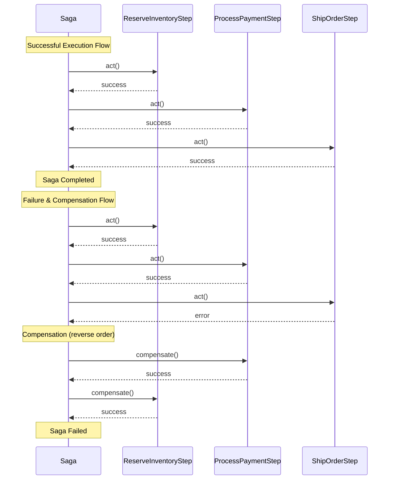
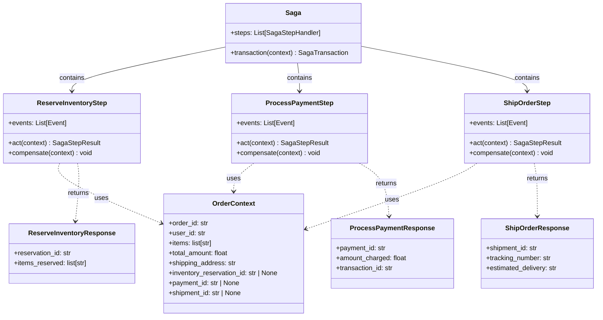

# Mermaid Diagram Generation for Saga

The package includes built-in support for generating Mermaid diagrams from Saga instances. This feature is perfect for documentation, visualization, and understanding saga structure and execution flow.

## Overview

The `SagaMermaid` class can generate two types of diagrams:

1. **Sequence Diagram** - Shows the execution flow, success/failure scenarios, and compensation logic
2. **Class Diagram** - Shows the type structure, relationships between Saga, steps, contexts, responses, and events

## Example

You can find a complete working example in the repository:

[**View Example: `saga_mermaid.py`**](https://github.com/vadikko2/python-cqrs/blob/master/examples/saga_mermaid.py)

### Basic Usage

```python
from cqrs.saga.mermaid import SagaMermaid
from cqrs.saga.saga import Saga
from cqrs.saga.storage.memory import MemorySagaStorage

# Create your saga (see Saga Pattern documentation for details)
saga = Saga(
    steps=[ReserveInventoryStep, ProcessPaymentStep, ShipOrderStep],
    container=container,
    storage=MemorySagaStorage(),
)

# Create Mermaid generator
generator = SagaMermaid(saga)

# Generate Sequence diagram showing execution flow
sequence_diagram = generator.sequence()
print(sequence_diagram)

# Generate Class diagram showing type structure
class_diagram = generator.class_diagram()
print(class_diagram)
```

## Sequence Diagram

The Sequence diagram visualizes the complete execution flow of a saga, including:

- All saga steps in execution order (act methods)
- Successful execution flow
- Failure scenarios with automatic compensation
- Compensation flow in reverse order

### Example Saga Code

```python
from cqrs.saga.saga import Saga
from cqrs.saga.step import SagaStepHandler, SagaStepResult
from cqrs.saga.models import SagaContext
from cqrs.response import Response
import dataclasses

@dataclasses.dataclass
class OrderContext(SagaContext):
    order_id: str
    user_id: str
    items: list[str]
    total_amount: float
    shipping_address: str
    inventory_reservation_id: str | None = None
    payment_id: str | None = None
    shipment_id: str | None = None

class ReserveInventoryResponse(Response):
    reservation_id: str
    items_reserved: list[str]

class ProcessPaymentResponse(Response):
    payment_id: str
    amount_charged: float
    transaction_id: str

class ShipOrderResponse(Response):
    shipment_id: str
    tracking_number: str
    estimated_delivery: str

class ReserveInventoryStep(SagaStepHandler[OrderContext, ReserveInventoryResponse]):
    # ... implementation
    
class ProcessPaymentStep(SagaStepHandler[OrderContext, ProcessPaymentResponse]):
    # ... implementation
    
class ShipOrderStep(SagaStepHandler[OrderContext, ShipOrderResponse]):
    # ... implementation

saga = Saga(
    steps=[ReserveInventoryStep, ProcessPaymentStep, ShipOrderStep],
    container=container,
    storage=storage,
)
```

### Generated Sequence Diagram

#### Text Format

```text
sequenceDiagram
    participant S as Saga
    participant S1 as ReserveInventoryStep
    participant S2 as ProcessPaymentStep
    participant S3 as ShipOrderStep

    Note over S: Successful Execution Flow
    S->>S1: act()
    S1-->>S: success
    S->>S2: act()
    S2-->>S: success
    S->>S3: act()
    S3-->>S: success
    Note over S: Saga Completed

    Note over S: Failure & Compensation Flow
    S->>S1: act()
    S1-->>S: success
    S->>S2: act()
    S2-->>S: success
    S->>S3: act()
    S3-->>S: error

    Note over S: Compensation (reverse order)
    S->>S2: compensate()
    S2-->>S: success
    S->>S1: compensate()
    S1-->>S: success
    Note over S: Saga Failed
```

#### Rendered Diagram



## Class Diagram

The Class diagram shows the complete type structure and relationships:

- Saga class with its methods and properties
- Step handler classes with their methods (`act`, `compensate`, `events`)
- Context classes with their fields
- Response classes with their fields
- Relationships between classes (composition, usage, return types)

### Generated Class Diagram

#### Text Format

```text
classDiagram
    class Saga {
        +steps: List[SagaStepHandler]
        +transaction(context) SagaTransaction
    }

    class ReserveInventoryStep {
        +act(context) SagaStepResult
        +compensate(context) void
        +events: List[Event]
    }

    class ProcessPaymentStep {
        +act(context) SagaStepResult
        +compensate(context) void
        +events: List[Event]
    }

    class ShipOrderStep {
        +act(context) SagaStepResult
        +compensate(context) void
        +events: List[Event]
    }

    class OrderContext {
        +order_id: str
        +user_id: str
        +items: list[str]
        +total_amount: float
        +shipping_address: str
        +inventory_reservation_id: str | None
        +payment_id: str | None
        +shipment_id: str | None
    }

    class ReserveInventoryResponse {
        +reservation_id: str
        +items_reserved: list[str]
    }

    class ProcessPaymentResponse {
        +payment_id: str
        +amount_charged: float
        +transaction_id: str
    }

    class ShipOrderResponse {
        +shipment_id: str
        +tracking_number: str
        +estimated_delivery: str
    }

    %% Saga relationships
    Saga --> ReserveInventoryStep : contains
    Saga --> ProcessPaymentStep : contains
    Saga --> ShipOrderStep : contains

    %% Step to Context relationships
    ReserveInventoryStep ..> OrderContext : uses
    ProcessPaymentStep ..> OrderContext : uses
    ShipOrderStep ..> OrderContext : uses

    %% Step to Response relationships
    ReserveInventoryStep ..> ReserveInventoryResponse : returns
    ProcessPaymentStep ..> ProcessPaymentResponse : returns
    ShipOrderStep ..> ShipOrderResponse : returns
```

#### Rendered Diagram



## Usage in Documentation

Generated diagrams can be:

- **Copied and pasted** into [Mermaid Live Editor](https://mermaid.live/) for visualization
- **Embedded directly** in Markdown files (GitHub/GitLab support Mermaid)
- **Used in documentation tools** (Confluence, Notion, etc.)
- **Included in README files** for better understanding

### Running the Example

To see the diagrams generated from a real saga, run:

```bash
python examples/saga_mermaid.py
```

This will output both Sequence and Class diagrams in a format ready to copy and paste into any Mermaid-compatible viewer.

## API Reference

### SagaMermaid Class

#### `__init__(saga: Saga[Any])`

Initialize Mermaid diagram generator.

**Parameters:**
- `saga`: The saga instance to generate diagram for

#### `sequence() -> str`

Generate a Mermaid Sequence diagram showing all saga steps and compensations.

**Returns:**
- A string containing the Mermaid Sequence diagram code

#### `class_diagram() -> str`

Generate a Mermaid Class diagram showing saga structure, types, and relationships.

**Returns:**
- A string containing the Mermaid Class diagram code

## See Also

- [Mermaid Overview](../mermaid/index.md) - Overview of Mermaid diagram generation
- [Saga Pattern Overview](../saga/index.md) - Learn about the Saga pattern implementation
- [Saga Flow Diagrams](../saga/flow.md) - Understanding saga execution flow
- [Saga Recovery](../saga/recovery.md) - Understanding saga recovery mechanisms
- [Saga Compensation](../saga/compensation.md) - Compensation strategies
- [Saga Examples](../saga/examples.md) - Complete examples
- [Example: Basic Saga](https://github.com/vadikko2/python-cqrs/blob/master/examples/saga.py)
- [Example: Saga Mermaid Diagrams](https://github.com/vadikko2/python-cqrs/blob/master/examples/saga_mermaid.py)
