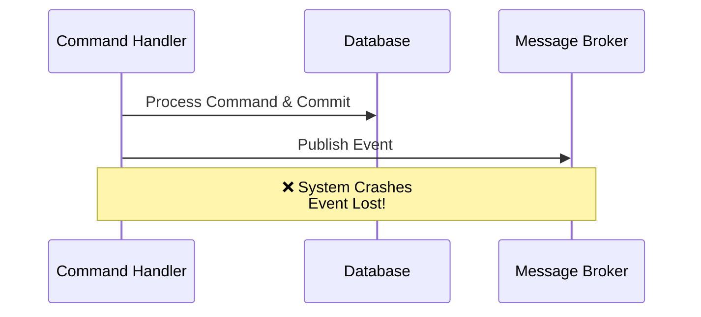
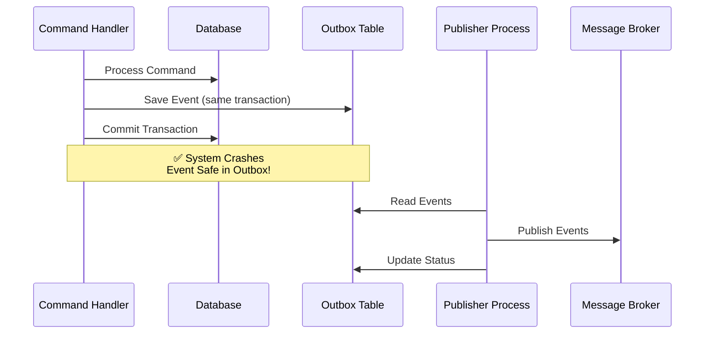
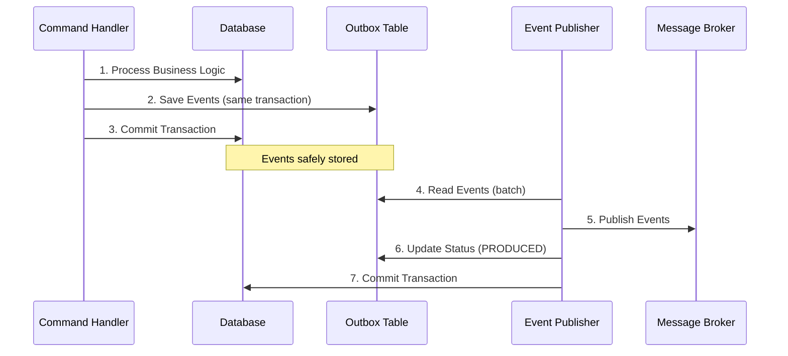
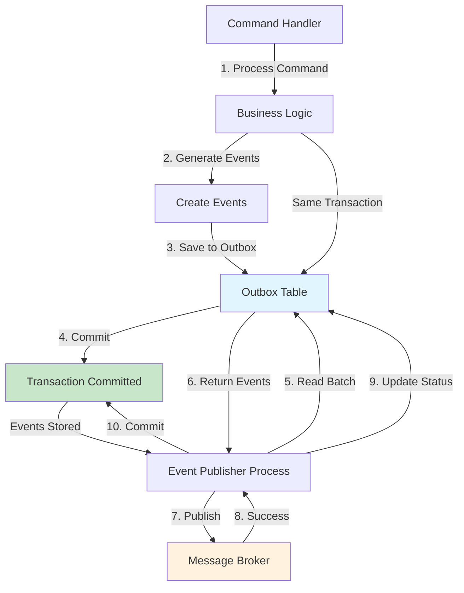

# Transactional Outbox

The Transactional Outbox pattern ensures reliable event publishing by storing events in a database table within the same transaction as business logic. This guarantees that events are persisted even if the system crashes before they can be published to a message broker.

## Overview

-   :material-code-tags: **Implementation**

    Interface and SQLAlchemy implementation for transactional outbox.

    [:octicons-arrow-right-24: Read More](implementation.md)

-   :material-play-circle: **Usage**

    Event registration and publishing with at-least-once delivery guarantees.

    [:octicons-arrow-right-24: Read More](usage.md)

-   :material-code-json: **Examples**

    Complete examples of transactional outbox pattern.

    [:octicons-arrow-right-24: Read More](examples.md)

-   :material-lightbulb-on: **Best Practices**

    Best practices and recommendations for reliable event delivery.

    [:octicons-arrow-right-24: Read More](best_practices.md)

The Transactional Outbox pattern solves the problem of ensuring event delivery in distributed systems. When a command handler processes a request and generates events, those events need to be published to a message broker. However, if the system crashes between processing the command and publishing the event, the event can be lost.

The Outbox pattern solves this by:

| Step | Description | Benefit |
|------|-------------|---------|
| **1. Store in Database** | Events are saved to an outbox table in the same transaction as business logic | Guaranteed persistence |
| **2. Separate Publishing** | A background process reads from the outbox and publishes events | Decoupled publishing |
| **3. At-least-once Delivery** | Events are only removed from outbox after successful publishing | Reliable delivery |

!!! note "Prerequisites"
    Understanding of [Event Handling](../event_handler/index.md) is required. The Outbox pattern ensures reliable delivery of events that are emitted by command handlers.

!!! tip "Related Topics"
    - [Event Producing](../event_producing.md) — For configuring message brokers
    - [FastStream Integration](../faststream.md) — For consuming events from message brokers
    - [Bootstrap](../bootstrap/index.md) — For configuring outbox in bootstrap process

## Why Use Transactional Outbox?

### The Problem

Without the Outbox pattern, event publishing can fail:

### The Solution

With the Outbox pattern, events are safely stored:

## Pattern Flow

The Transactional Outbox pattern follows this flow:

### Detailed Flow Diagram

