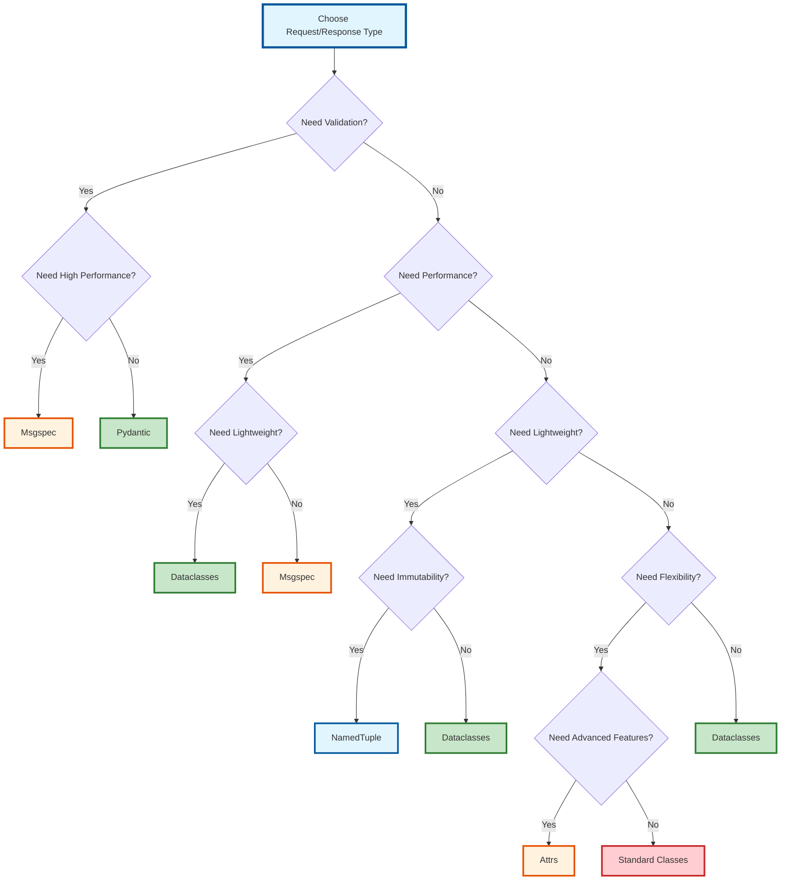

# Best Practices

Recommendations for choosing and using request/response types in your CQRS application.

## Choosing the Right Type

### Decision Tree



**Type Descriptions:**

- **Pydantic** — Rich validation & features, best for web APIs
- **Msgspec** — High-performance with validation, up to 10x faster than Pydantic
- **Dataclasses** — Fast & lightweight, no dependencies, default choice
- **NamedTuple** — Immutable & memory-efficient
- **Attrs** — Advanced features beyond standard dataclasses
- **Standard Classes** — Full control over implementation

**Step-by-step guide:**

1. **Need Validation?**
   - ✅ Yes → Choose between **Pydantic** (rich features) or **Msgspec** (high performance)
   - ❌ No → Continue to step 2

2. **Need Performance?**
   - ✅ Yes → Choose **Msgspec** (fastest) or **Dataclasses** (fast & lightweight)
   - ❌ No → Continue to step 3

3. **Need Lightweight?**
   - ✅ Yes → Choose **Dataclasses** (simple) or **NamedTuple** (immutable)
   - ❌ No → Continue to step 4

4. **Need Flexibility?**
   - ✅ Yes → Choose **Standard Classes** (full control) or **Attrs** (advanced features)
   - ❌ No → Use **Dataclasses** (default choice)

### Quick Reference

| Requirement | Recommended Type |
|-------------|-----------------|
| Web APIs with validation | Pydantic |
| High-performance microservices | Msgspec |
| Internal systems, lightweight | Dataclasses |
| Immutable, memory-efficient | NamedTuple |
| Advanced features | Attrs |
| Static type checking only | TypedDict |
| Full control | Standard Classes |

## Consistency Guidelines

### Within a Domain

Use the same type for related requests and responses:

```python
# ✅ Good: Consistent types
class CreateUserCommand(cqrs.PydanticRequest):
    pass

class UserResponse(cqrs.PydanticResponse):
    pass

# ❌ Avoid: Mixed types without reason
class CreateUserCommand(cqrs.PydanticRequest):
    pass

class UserResponse(cqrs.DCResponse):  # Why different?
    pass
```

### Across Domains

Different domains can use different types based on their needs:

```python
# User domain - needs validation
class CreateUserCommand(cqrs.PydanticRequest):
    pass

# Analytics domain - performance critical
class ProcessEventRequest(cqrs.IRequest, msgspec.Struct):
    pass
```

## Validation Strategy

### External Input

Always validate external input:

```python
# ✅ Good: Validate external input
class CreateUserCommand(cqrs.PydanticRequest):
    email: str = pydantic.Field(pattern=r'^[\w\.-]+@[\w\.-]+\.\w+$')
    age: int = pydantic.Field(gt=0, le=120)
```

### Internal Communication

Internal communication can use lighter types:

```python
# ✅ Good: Lightweight for internal use
@dataclasses.dataclass
class InternalQuery(cqrs.DCRequest):
    user_id: str
```

## Performance Considerations

### High-Throughput Scenarios

For high-throughput scenarios, consider Msgspec:

```python
# High-performance request
class ProcessRequest(cqrs.IRequest, msgspec.Struct):
    data: str
```

### Simple Data Structures

For simple data, Dataclasses are fast enough:

```python
@dataclasses.dataclass
class SimpleRequest(cqrs.DCRequest):
    id: str
    value: int
```

## Migration Strategy

### Gradual Migration

All types implement the same interface, so migration is straightforward:

```python
# Step 1: Start with Pydantic
class MyCommand(cqrs.PydanticRequest):
    pass

# Step 2: Migrate to Dataclass
@dataclasses.dataclass
class MyCommand(cqrs.DCRequest):
    pass
```

### Testing Migration

Test thoroughly when migrating:

```python
# Test that serialization works
def test_migration():
    command = MyCommand(id="123")
    data = command.to_dict()
    restored = MyCommand.from_dict(**data)
    assert restored.id == "123"
```

## Common Patterns

### Pattern 1: Validate Input, Optimize Output

```python
# Validate external input
class CreateOrderCommand(cqrs.PydanticRequest):
    user_id: str
    items: list[str]

# Lightweight response
@dataclasses.dataclass
class OrderResponse(cqrs.DCResponse):
    order_id: str
```

### Pattern 2: Performance-Critical

```python
# High-performance request
class ProcessRequest(cqrs.IRequest, msgspec.Struct):
    data: str

# Simple response
@dataclasses.dataclass
class ProcessResponse(cqrs.DCResponse):
    result: str
```

### Pattern 3: Full Control

```python
# Custom validation and serialization
class CustomRequest(cqrs.IRequest):
    def __init__(self, data: str):
        if not data:
            raise ValueError("Data cannot be empty")
        self.data = data
    
    def to_dict(self) -> dict:
        return {"data": self.data}
    
    @classmethod
    def from_dict(cls, **kwargs) -> Self:
        return cls(**kwargs)
```

## Anti-Patterns

### ❌ Over-Engineering

Don't use complex types for simple use cases:

```python
# ❌ Over-engineered
class SimpleQuery(cqrs.IRequest, msgspec.Struct):
    id: str

# ✅ Simple enough
@dataclasses.dataclass
class SimpleQuery(cqrs.DCRequest):
    id: str
```

### ❌ Inconsistent Types

Don't mix types without reason:

```python
# ❌ Inconsistent
class CreateCommand(cqrs.PydanticRequest):
    pass

class UpdateCommand(cqrs.DCRequest):  # Why different?
    pass
```

### ❌ Skipping Validation

Don't skip validation for external input:

```python
# ❌ No validation for external input
@dataclasses.dataclass
class CreateUserCommand(cqrs.DCRequest):
    email: str  # No validation!

# ✅ Validate external input
class CreateUserCommand(cqrs.PydanticRequest):
    email: str = pydantic.Field(pattern=r'^[\w\.-]+@[\w\.-]+\.\w+$')
```

## Documentation

### Document Your Choices

Document why you chose a specific type:

```python
# Use Pydantic for external API requests to ensure validation
class CreateUserCommand(cqrs.PydanticRequest):
    """Uses Pydantic for runtime validation of external input."""
    email: str
```

### Team Guidelines

Create team guidelines for type selection:

```markdown
## Type Selection Guidelines

- External APIs: Use Pydantic
- Internal communication: Use Dataclasses
- High-performance: Use Msgspec
- Custom logic: Use Standard Classes
```

## See Also

- [Comparison Table](index.md#comparison-table) - Detailed comparison
- [Mixed Usage](mixed_usage.md) - Combining different types
- [Request Handlers](../request_handler/index.md) - Handler implementation
