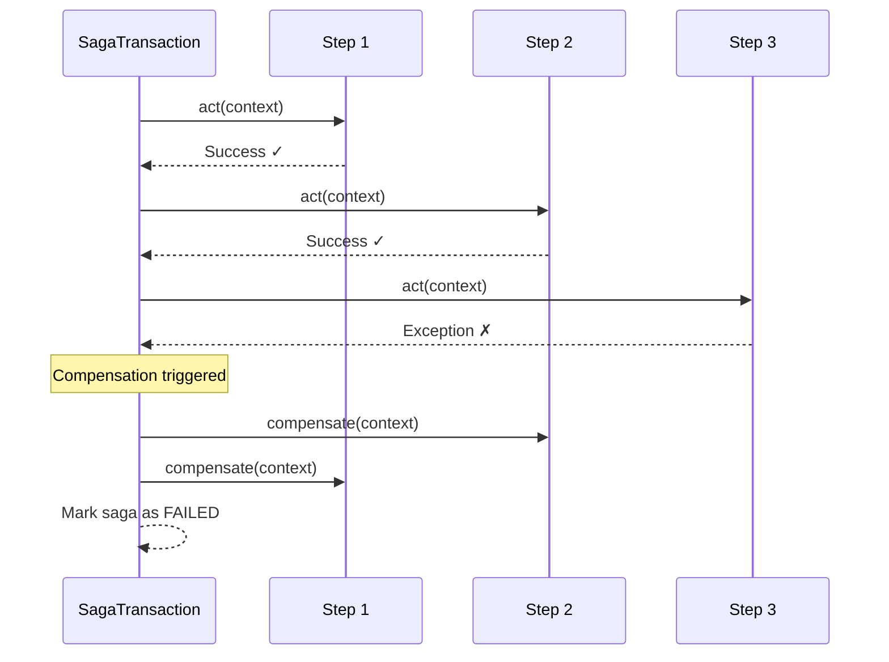

# Compensation Strategy

<div class="grid cards" markdown>

-   :material-home: **Back to Saga Overview**

    Return to the Saga Pattern overview page with all topics.

    [:octicons-arrow-left-24: Back to Overview](index.md)

</div>

Compensation undoes the effects of completed steps when a saga fails, ensuring resources are properly released and the system returns to a consistent state.

## Overview

When any step fails, all previously completed steps are automatically compensated in **reverse order**:

- Resources are properly released
- Partial operations are rolled back
- System returns to a consistent state

## How Compensation Works

Compensation is triggered automatically when a step's `act()` method raises an exception:



Compensation happens in **reverse order**:
```
Execution:    Step 1 → Step 2 → Step 3
Compensation: Step 3 ← Step 2 ← Step 1
```

## Implementing Compensation

Each step handler must implement the `compensate()` method:

```python
class ReserveInventoryStep(SagaStepHandler[OrderContext, Response]):
    async def act(self, context: OrderContext) -> SagaStepResult:
        reservation_id = await self._inventory_service.reserve_items(
            context.order_id, context.items
        )
        context.inventory_reservation_id = reservation_id
        return self._generate_step_result(Response())

    async def compensate(self, context: OrderContext) -> None:
        if context.inventory_reservation_id:
            await self._inventory_service.release_items(
                context.inventory_reservation_id
            )
```

### Best Practices

1. **Idempotent** — Safe to call multiple times
2. **Check Context** — Verify compensation is needed before executing
3. **Handle Errors** — Gracefully handle missing resources

### Idempotent Example

```python
async def compensate(self, context: OrderContext) -> None:
    if not context.inventory_reservation_id:
        return  # Already compensated
    
    try:
        await self._inventory_service.release_items(
            context.inventory_reservation_id
        )
        context.inventory_reservation_id = None
    except ValueError:
        pass  # Already released - idempotent
```

## Compensation Retry

Automatic retry for compensation failures:

```python
saga = Saga(
    steps=[...],
    container=container,
    storage=storage,
    compensation_retry_count=3,      # Number of retry attempts
    compensation_retry_delay=1.0,     # Initial delay in seconds
    compensation_retry_backoff=2.0,   # Exponential backoff multiplier
)
```

**Retry schedule:**

- Attempt 1: fails, wait 1.0s
- Attempt 2: fails, wait 2.0s (1.0 × 2.0)
- Attempt 3: fails, wait 4.0s (2.0 × 2.0)
- Attempt 4: final attempt

## Compensation Patterns

### Direct Reversal

```python
async def act(self, context: OrderContext) -> SagaStepResult:
    resource_id = await service.create_resource(data)
    context.resource_id = resource_id
    return self._generate_step_result(Response())

async def compensate(self, context: OrderContext) -> None:
    if context.resource_id:
        await service.delete_resource(context.resource_id)
```

### Compensating Transaction

```python
async def act(self, context: OrderContext) -> SagaStepResult:
    payment_id = await payment_service.charge(amount)
    context.payment_id = payment_id
    return self._generate_step_result(Response())

async def compensate(self, context: OrderContext) -> None:
    if context.payment_id:
        await payment_service.refund(context.payment_id)
```

### No-Op Compensation

```python
async def act(self, context: OrderContext) -> SagaStepResult:
    await notification_service.send(context.user_id, message)
    return self._generate_step_result(Response())

async def compensate(self, context: OrderContext) -> None:
    pass  # Notifications can't be "unsent"
```

## Common Pitfalls

### Non-Idempotent Compensation

```python
# ❌ Bad: Not idempotent
async def compensate(self, context: OrderContext) -> None:
    await service.delete_resource(context.resource_id)

# ✅ Good: Idempotent
async def compensate(self, context: OrderContext) -> None:
    if context.resource_id:
        try:
            await service.delete_resource(context.resource_id)
        except NotFoundError:
            pass
        context.resource_id = None
```

### Missing Context Check

```python
# ❌ Bad: May fail if resource doesn't exist
async def compensate(self, context: OrderContext) -> None:
    await service.release_items(context.inventory_reservation_id)

# ✅ Good: Checks before compensating
async def compensate(self, context: OrderContext) -> None:
    if context.inventory_reservation_id:
        await service.release_items(context.inventory_reservation_id)
```

## Best Practices

1. **Idempotent** — Safe to call multiple times
2. **Check Context** — Verify compensation is needed
3. **Handle Failures** — Log errors appropriately
4. **Test Logic** — Ensure compensation works correctly
