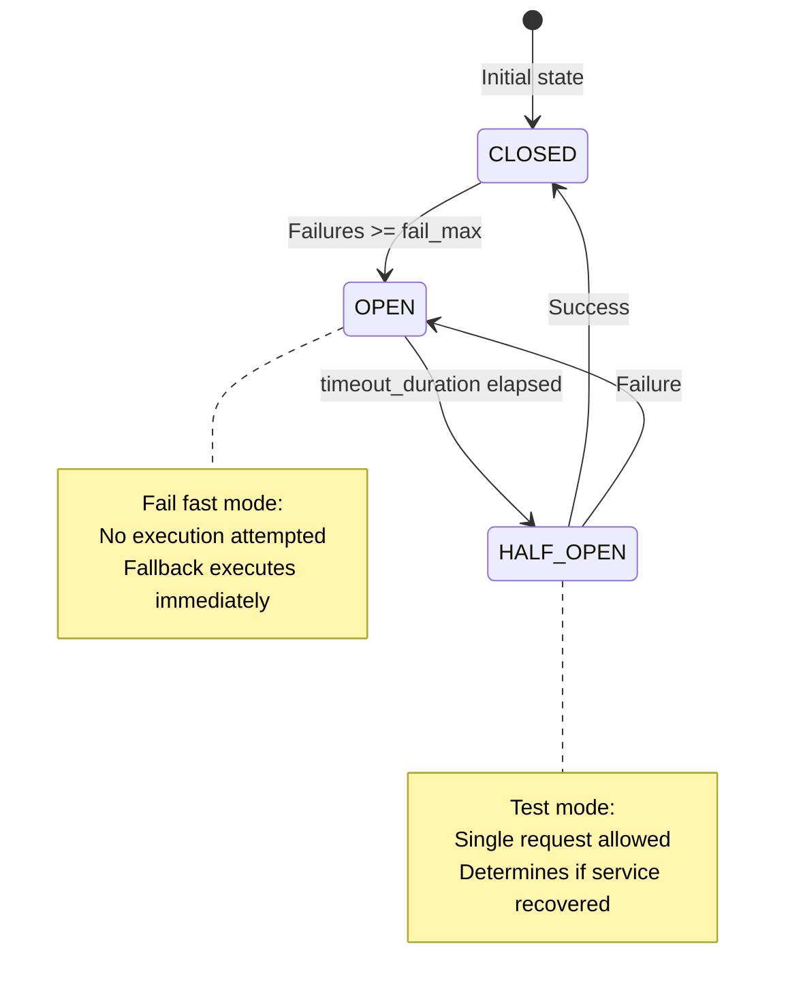

# Circuit Breaker Integration

Circuit Breaker prevents cascading failures by "opening" the circuit after repeated failures, failing fast instead of attempting execution.

## Why Circuit Breaker?

When a service is experiencing issues:

- **Without Circuit Breaker**: Every request attempts execution, wasting resources and potentially making the problem worse
- **With Circuit Breaker**: After threshold failures, requests fail immediately without attempting execution, reducing load on failing service

## Circuit Breaker States



## Circuit Breaker Strategy

The Circuit Breaker follows a **three-state pattern**:

1. **CLOSED** (Normal Operation)
   - Primary step executes normally
   - Failures are counted
   - After `fail_max` failures → transition to OPEN

2. **OPEN** (Fail Fast)
   - Primary step is **NOT executed** (fail fast)
   - `CircuitBreakerError` is raised immediately
   - Fallback executes automatically
   - After `timeout_duration` → transition to HALF_OPEN

3. **HALF_OPEN** (Testing Recovery)
   - Single request allowed (test if service recovered)
   - Success → transition to CLOSED
   - Failure → transition back to OPEN

## Configuration

```python
from cqrs.adapters.circuit_breaker import AioBreakerAdapter
from cqrs.saga.fallback import Fallback

Fallback(
    step=PrimaryStep,
    fallback=FallbackStep,
    circuit_breaker=AioBreakerAdapter(
        fail_max=3,              # Open circuit after 3 failures
        timeout_duration=60,      # Wait 60 seconds before retry (HALF_OPEN)
        exclude=[BusinessError],  # Don't count these as failures
    ),
)
```

**Parameters:**

| Parameter | Description | Default |
|-----------|-------------|---------|
| `fail_max` | Number of failures before opening circuit | `5` |
| `timeout_duration` | Seconds to wait before attempting HALF_OPEN | `60` |
| `exclude` | Exception types that don't count as failures | `[]` |

## Storage Configuration (Memory vs Redis)

By default, the circuit breaker uses in-memory storage, which is isolated to each application instance. For distributed applications, you can configure it to use Redis to share circuit state across all instances.

**In-Memory Storage (Default):**
```python
circuit_breaker = AioBreakerAdapter(
    fail_max=3,
    timeout_duration=60
)
```

**Redis Storage (Distributed):**
```python
import redis
from aiobreaker.storage.redis import CircuitRedisStorage
from aiobreaker import CircuitBreakerState

def redis_storage_factory(name: str):
    # Important: decode_responses=False for aiobreaker compatibility
    client = redis.from_url(
        "redis://localhost:6379", 
        encoding="utf-8", 
        decode_responses=False
    )
    return CircuitRedisStorage(
        state=CircuitBreakerState.CLOSED, 
        redis_object=client, 
        namespace=name
    )

circuit_breaker = AioBreakerAdapter(
    fail_max=3,
    timeout_duration=60,
    storage_factory=redis_storage_factory
)
```

## Failure Exception Filtering

You can specify which exceptions should trigger fallback execution:

```python
Fallback(
    step=PrimaryStep,
    fallback=FallbackStep,
    failure_exceptions=(ConnectionError, TimeoutError),  # Only these trigger fallback
)
```

**Behavior:**

- If `failure_exceptions` is empty tuple `()`: **All exceptions** trigger fallback (default)
- If `failure_exceptions` is specified: **Only matching exceptions** trigger fallback
- Non-matching exceptions propagate immediately (saga fails without fallback)

## Business Exception Exclusion

Some exceptions shouldn't open the circuit (e.g., business logic errors):

```python
class InventoryOutOfStockError(Exception):
    pass

Fallback(
    step=PrimaryStep,
    fallback=FallbackStep,
    circuit_breaker=AioBreakerAdapter(
        fail_max=3,
        timeout_duration=60,
        exclude=[InventoryOutOfStockError],  # Don't count as failure
    ),
)
```

**Behavior:**

- `InventoryOutOfStockError` → Fallback executes, but circuit counter is **not incremented**
- Other exceptions → Fallback executes, circuit counter **is incremented**
