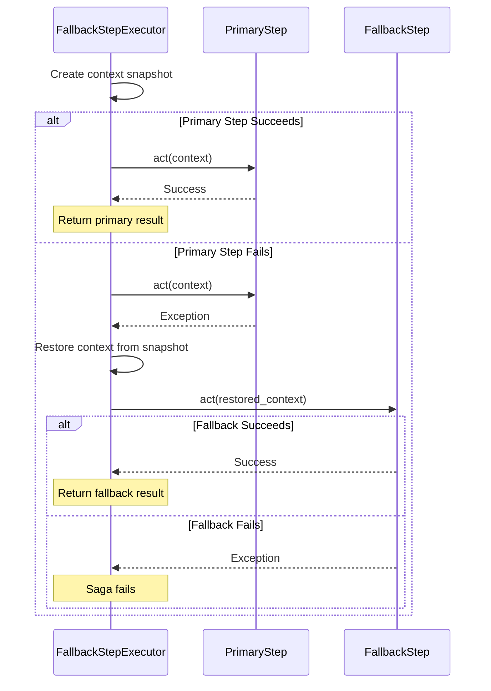

# Mechanics & Internals

## How It Works

### Execution Flow



### Context Management

The Fallback pattern implements a **snapshot and restore** mechanism for context management:

1. **Before Primary Execution**: A deep copy of the context is created (`copy.deepcopy(context.to_dict())`)
2. **If Primary Fails**: The context is restored to the snapshot state before fallback execution
3. **If Primary Succeeds**: The snapshot is discarded and context updates from primary step are kept

This ensures that:

- Fallback steps start with a clean state (no side effects from failed primary)
- Context mutations from primary step are not visible to fallback
- Each step execution is isolated

```python
# Simplified context snapshot/restore logic
context_snapshot = copy.deepcopy(context.to_dict())  # Before primary

try:
    result = await primary_step.act(context)  # May modify context
except Exception:
    # Restore context to snapshot state
    restored_context = context.__class__.from_dict(context_snapshot)
    for field in dataclasses.fields(context):
        setattr(context, field.name, getattr(restored_context, field.name))
    
    # Execute fallback with restored context
    result = await fallback_step.act(context)
```

## Step Execution Details

### Primary Step Execution

1. **Context Snapshot**: Deep copy created before execution
2. **Logging**: Step start logged to `SagaLog`
3. **Execution**: 
   - If Circuit Breaker present: `circuit_breaker.call(step_type, primary_step.act, context)`
   - Otherwise: `primary_step.act(context)` directly
4. **Success**: Context updated, step completion logged
5. **Failure**: Exception caught, fallback logic triggered

### Fallback Step Execution

1. **Context Restore**: Context restored to snapshot state (before primary execution)
2. **Logging**: Fallback step start logged
3. **Execution**: `fallback_step.act(restored_context)`
4. **Success**: Context updated, fallback completion logged
5. **Failure**: Exception propagated (saga fails)

### Idempotency

Fallback steps respect idempotency checks:

- If primary step name is in `completed_step_names` → Skip execution
- If fallback step name is in `completed_step_names` → Skip execution
- This ensures recovery doesn't re-execute already completed steps

## Compensation

Both primary and fallback steps can define `compensate()` methods:

```python
class PrimaryStep(SagaStepHandler[OrderContext, ReserveInventoryResponse]):
    async def act(self, context: OrderContext) -> SagaStepResult:
        # ... primary logic ...
    
    async def compensate(self, context: OrderContext) -> None:
        # Compensate primary step
        if context.reservation_id:
            await self._inventory_service.release_items(context.reservation_id)

class FallbackStep(SagaStepHandler[OrderContext, ReserveInventoryResponse]):
    async def act(self, context: OrderContext) -> SagaStepResult:
        # ... fallback logic ...
    
    async def compensate(self, context: OrderContext) -> None:
        # Compensate fallback step
        if context.reservation_id:
            await self._inventory_service.release_fallback_reservation(context.reservation_id)
```

**Compensation Rules:**

- Only the **actually executed step** (primary or fallback) is compensated
- If primary succeeded → only primary's `compensate()` is called
- If fallback executed → only fallback's `compensate()` is called

## Storage and Logging

Fallback execution is fully logged in `SagaLog`:

**Successful Primary:**
```
- primary_step.act STARTED
- primary_step.act COMPLETED
```

**Failed Primary → Successful Fallback:**
```
- primary_step.act STARTED
- fallback_step.act STARTED
- fallback_step.act COMPLETED
```

**Failed Primary → Failed Fallback:**
```
- primary_step.act STARTED
- fallback_step.act STARTED
- fallback_step.act FAILED (error details)
```

**Circuit Breaker OPEN:**
```
- fallback_step.act STARTED (primary not executed)
- fallback_step.act COMPLETED
```
