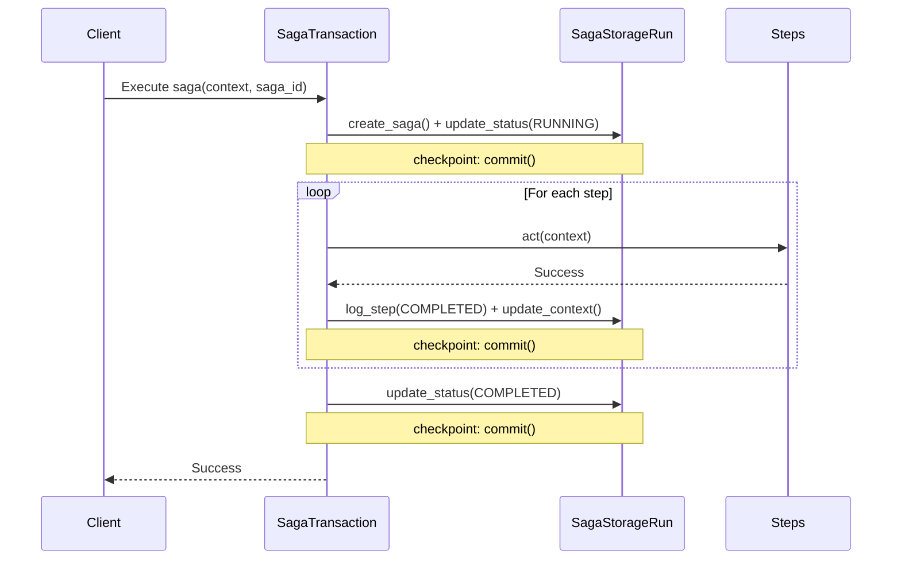
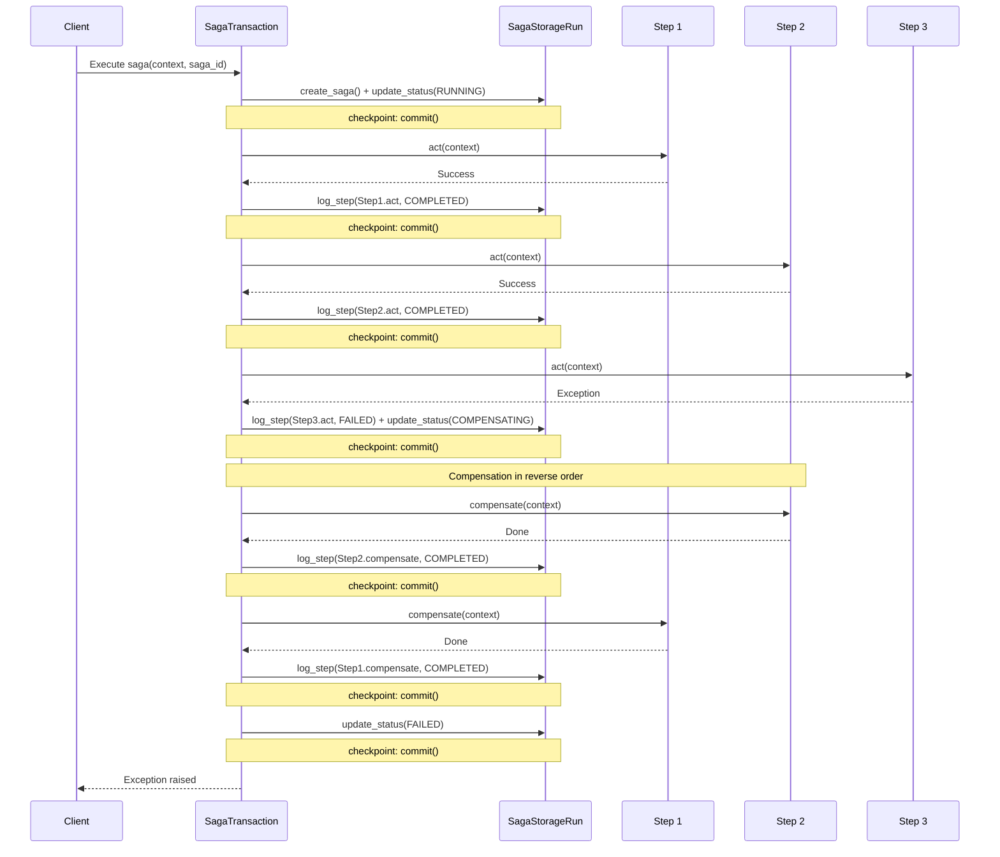
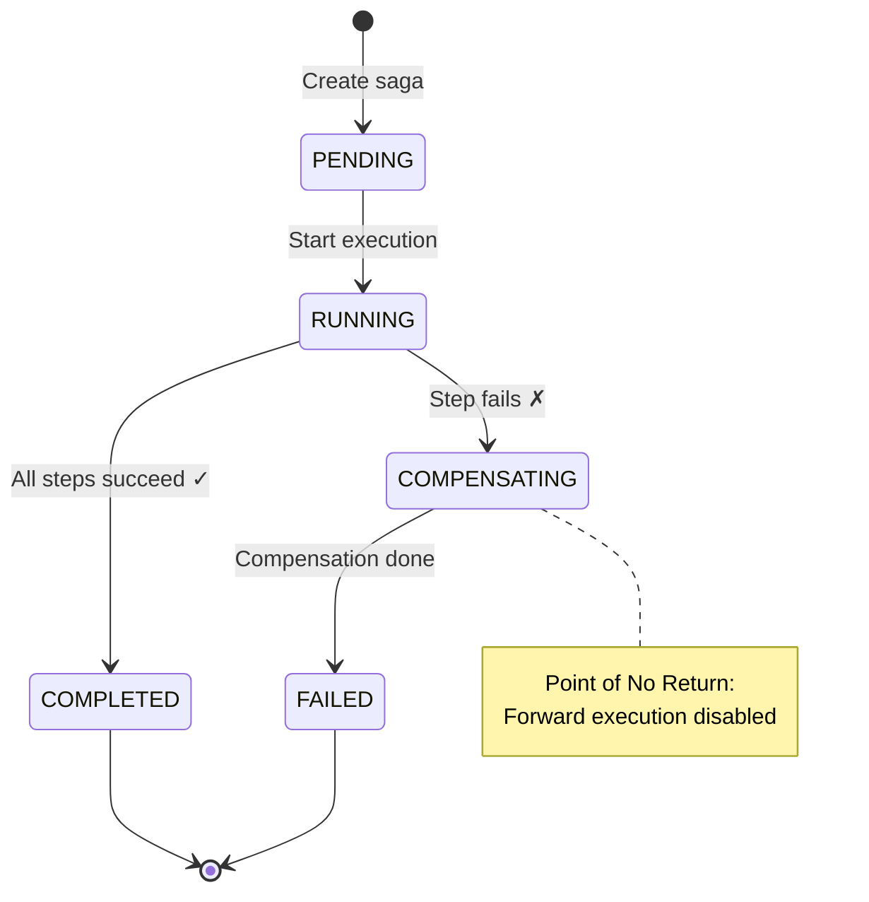
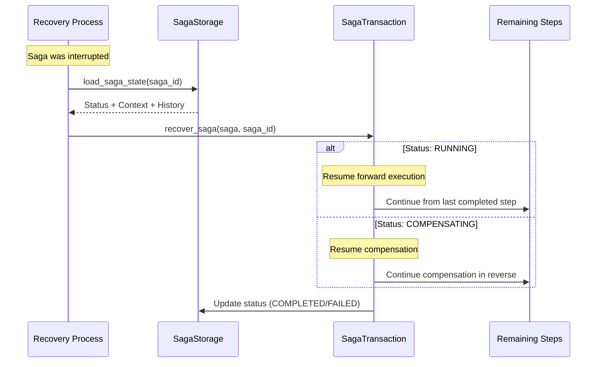

# Saga Flow Diagrams

-   :material-home: **Back to Saga Overview**

    Return to the Saga Pattern overview page with all topics.

    [:octicons-arrow-left-24: Back to Overview](index.md)

Visual representations of saga execution, compensation, and recovery flows.

## Execution Flow

### Successful Saga Execution

When the storage supports **`create_run()`**, the saga runs inside one session and **commits only at checkpoints** (after create + RUNNING, after each step, at COMPLETED). Otherwise, each storage call may commit immediately (legacy behaviour).

### Failed Saga with Compensation

When using a **run** (checkpoint path), a **commit** occurs after each completed step and after each compensated step; then once at the end when status is set to FAILED.

## State Transitions

### Saga Status Flow

## Recovery Flow

### Recovery Process

## Storage Structure

### Tables

**saga_executions:**

- `id` (UUID) - Primary key
- `status` (Enum) - PENDING, RUNNING, COMPENSATING, COMPLETED, FAILED
- `context` (JSON) - Serialized context data
- `created_at`, `updated_at` (DateTime)

**saga_logs:**

- `id` (BigInteger) - Primary key
- `saga_id` (UUID) - Foreign key
- `step_name` (String)
- `action` (String) - "act" or "compensate"
- `status` (Enum) - STARTED, COMPLETED, FAILED
- `details` (Text) - Error message if failed
- `created_at` (DateTime)
