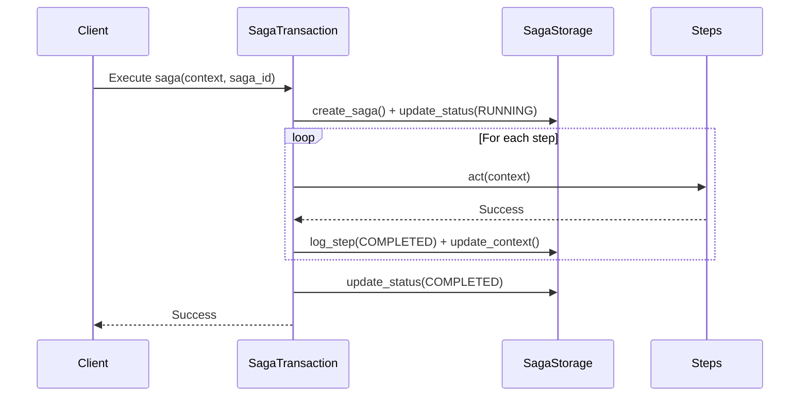
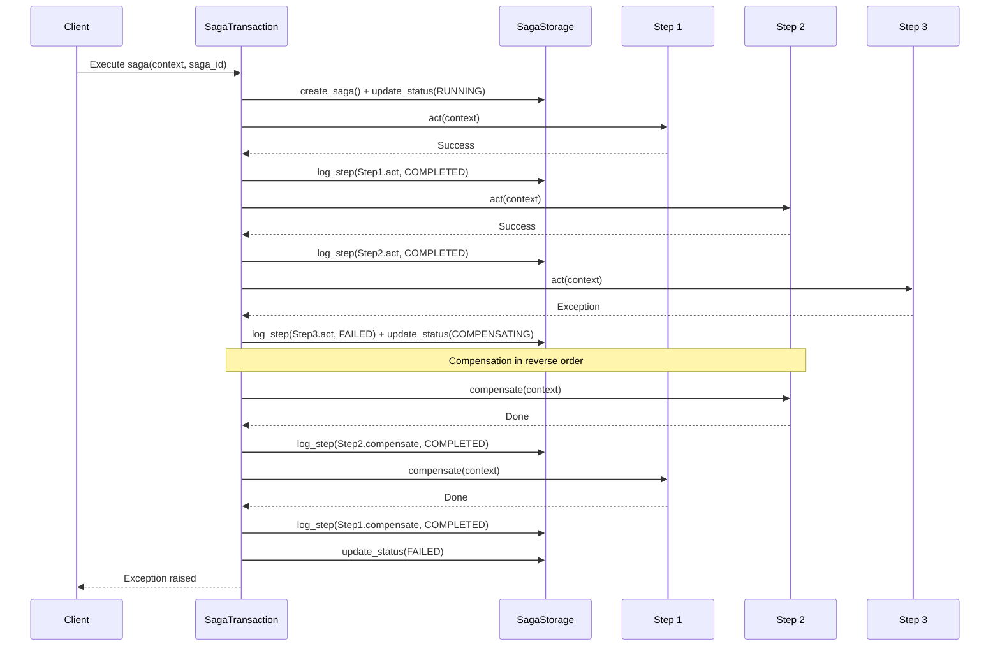
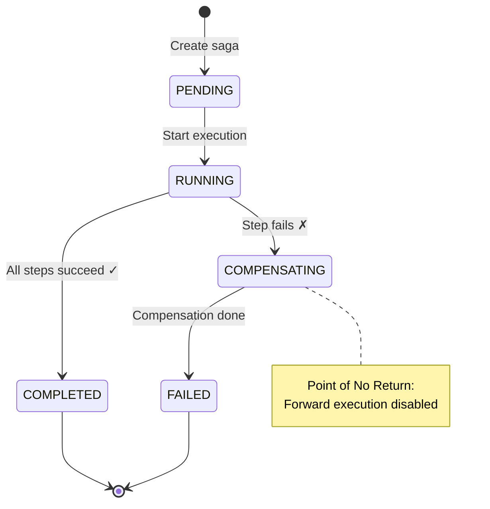
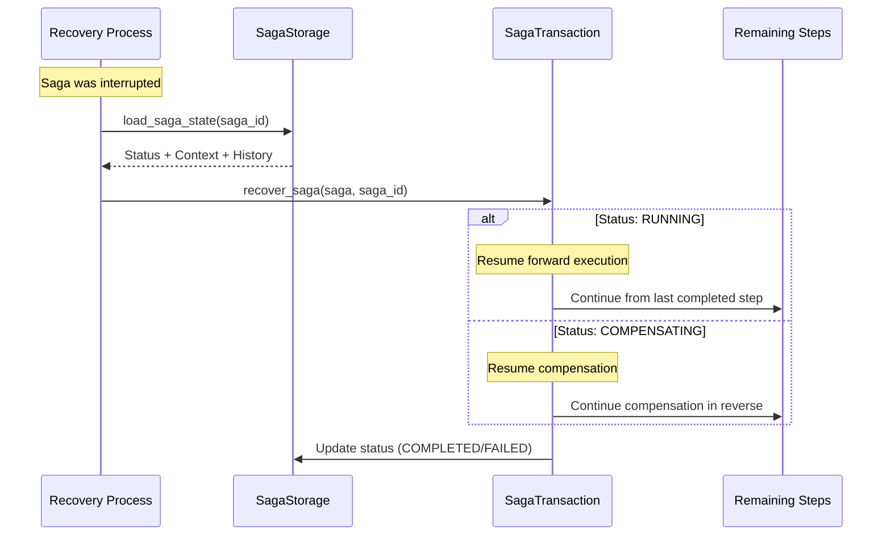

# Saga Flow Diagrams

Visual representations of saga execution, compensation, and recovery flows.

## Execution Flow

### Successful Saga Execution

### Failed Saga with Compensation

## State Transitions

### Saga Status Flow

## Recovery Flow

### Recovery Process

## Storage Structure

### Tables

**saga_executions:**

- `id` (UUID) - Primary key
- `status` (Enum) - PENDING, RUNNING, COMPENSATING, COMPLETED, FAILED
- `context` (JSON) - Serialized context data
- `created_at`, `updated_at` (DateTime)

**saga_logs:**

- `id` (BigInteger) - Primary key
- `saga_id` (UUID) - Foreign key
- `step_name` (String)
- `action` (String) - "act" or "compensate"
- `status` (Enum) - STARTED, COMPLETED, FAILED
- `details` (Text) - Error message if failed
- `created_at` (DateTime)
