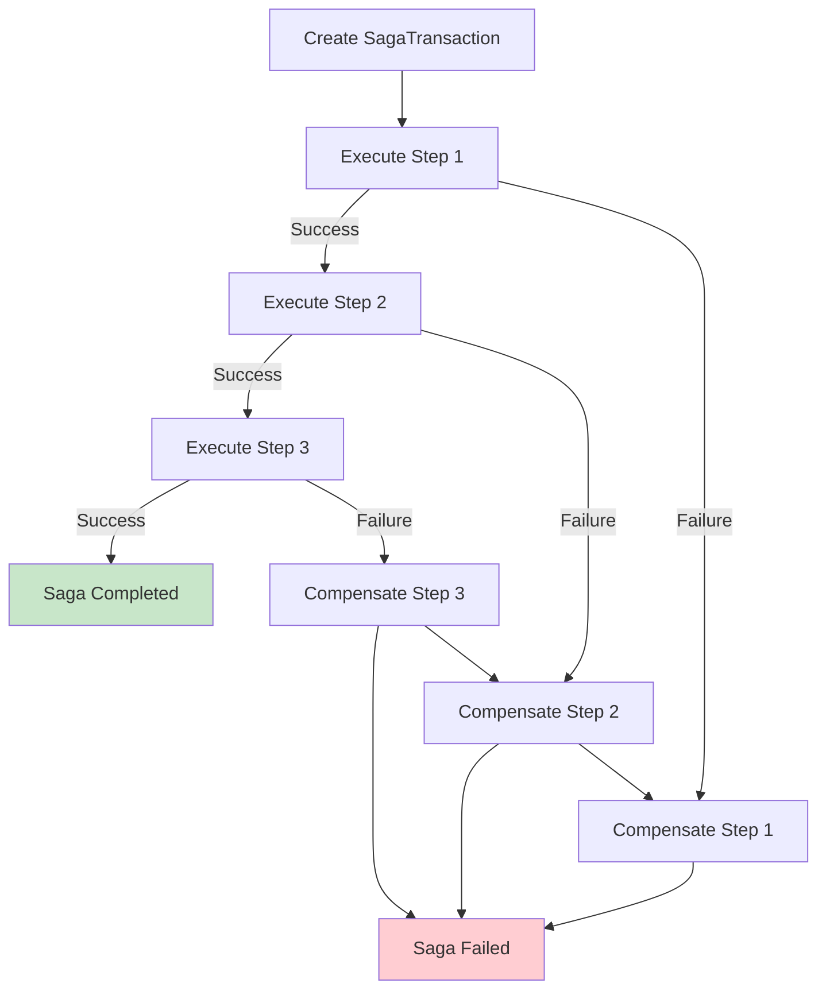

# Saga Pattern

The Saga pattern enables distributed transactions across multiple services by executing a series of steps where each step can be compensated if a subsequent step fails. This allows for eventual consistency across distributed systems without requiring two-phase commit.

## Overview

The `python-cqrs` package implements the **Choreographic Saga** pattern. `SagaTransaction` manages step execution sequentially and handles automatic compensation on failure.

!!! important "Choreographic Saga"
    `SagaTransaction` coordinates step execution, but each step handler is responsible for its own logic. The transaction manages flow, state persistence, and automatic compensation.

### Key Concepts

| Concept | Description |
|---------|-------------|
| **SagaTransaction** | Context manager that executes steps sequentially and handles compensation |
| **Saga** | Class that defines steps and creates `SagaTransaction` instances |
| **Step Handler** | Operation with `act()` and `compensate()` methods |
| **Context** | Shared state object passed between all steps |
| **Storage** | Persists saga state and execution history for recovery |
| **Compensation** | Automatic rollback of completed steps in reverse order on failure |
| **Recovery** | Mechanism to resume interrupted sagas from persistent storage |

!!! note "Prerequisites"
    Understanding of [Request Handlers](../request_handler.md) and [Dependency Injection](../di.md) is recommended.

!!! tip "When to Use"
    Use Saga pattern when coordinating multiple operations across different services, where each operation can be compensated if the overall transaction fails.

## How It Works

`SagaTransaction` executes steps sequentially and automatically compensates completed steps in reverse order if any step fails:



## Basic Example

```python
from cqrs.saga.saga import Saga
from cqrs.saga.step import SagaStepHandler, SagaStepResult
from cqrs.saga.storage.memory import MemorySagaStorage
from cqrs.saga.models import SagaContext
from cqrs.response import Response
import dataclasses
import uuid

# Context
@dataclasses.dataclass
class OrderContext(SagaContext):
    order_id: str
    items: list[str]
    total_amount: float
    inventory_reservation_id: str | None = None
    payment_id: str | None = None

# Step handler
class ReserveInventoryStep(SagaStepHandler[OrderContext, Response]):
    def __init__(self, inventory_service):
        self._inventory_service = inventory_service

    async def act(self, context: OrderContext) -> SagaStepResult:
        reservation_id = await self._inventory_service.reserve_items(
            context.order_id, context.items
        )
        context.inventory_reservation_id = reservation_id
        return self._generate_step_result(Response())

    async def compensate(self, context: OrderContext) -> None:
        if context.inventory_reservation_id:
            await self._inventory_service.release_items(
                context.inventory_reservation_id
            )

# Create and execute saga
storage = MemorySagaStorage()
saga = Saga(
    steps=[ReserveInventoryStep],
    container=container,
    storage=storage,
)

async with saga.transaction(context=context, saga_id=uuid.uuid4()) as transaction:
    async for step_result in transaction:
        print(f"Step completed: {step_result.step_type.__name__}")
```

## Key Features

- **Automatic Compensation** — Failed steps trigger compensation of completed steps in reverse order
- **State Persistence** — Saga state and execution history saved after each step
- **Recovery** — Interrupted sagas can be resumed from persistent storage
- **Eventual Consistency** — All sagas eventually reach terminal state (COMPLETED or FAILED)

## Documentation

- **[Flow Diagrams](flow.md)** — Visual representation of execution and compensation flows
- **[Storage](storage.md)** — Memory and SQLAlchemy storage implementations
- **[Recovery](recovery.md)** — How recovery ensures eventual consistency
- **[Compensation](compensation.md)** — Compensation mechanism and best practices
- **[Examples](examples.md)** — Complete examples including FastAPI SSE integration
